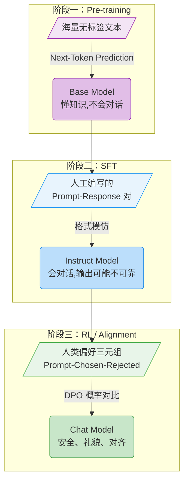
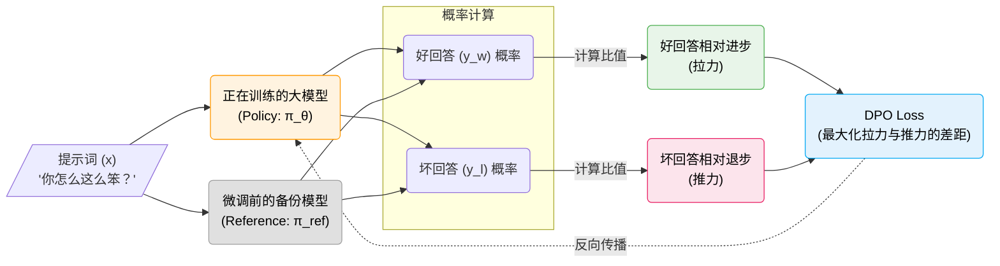

# 2.4 理论初探：Post-Training 是什么？

经过这 5 分钟的实验，我们已经通过 DPO 改变了模型的语言行为。为了将前面的实验放到更宏观的语境中，我们需要了解大模型训练的三个阶段（Post-Training Pipeline）。

这三个阶段分别如下：

### 阶段一：预训练（Pre-training）

将海量文本序列作为输入，模型通过“预测下一个词”（Next-Token Prediction）学习世界知识和语言规律。这是代价最高的一步，赋予了模型基础能力。

- **输入**：维基百科、书籍、网页代码等无标签纯文本。
- **目标**：预测下一个词。
- **结果**：具备语言能力和世界知识，但无法以对话方式回应的基座模型（Base Model）。
- **数据示例（纯文本）**：
  ```json
  {
    "text": "巴黎是法国的首都，位于法国北部巴黎盆地的中央，建都已有1400多年的历史..."
  }
  ```

### 阶段二：监督微调（Supervised Fine-Tuning, SFT）

将高质量的问答对作为输入，让模型学会以对话格式回应人类。

- **输入**：人工编写的 (Prompt, Response) 对。
- **目标**：模仿人类的回答格式。
- **结果**：一个能一问一答的助手（Instruct Model）。
- **数据示例（问答对）**：
  ```json
  {
    "prompt": "请问法国的首都是哪里？",
    "response": "法国的首都是巴黎。它位于法国北部巴黎盆地的中央。"
  }
  ```

### 阶段三：强化学习与对齐（RL/Alignment）

也就是我们刚才运行的 DPO 环节。将偏好数据（好坏对比）作为输入，让模型学会区分高质量的回答和低质量的回答。

- **输入**：(Prompt, Chosen, Rejected) 三元组。
- **目标**：最大化好回答与坏回答的概率差。
- **结果**：回答质量更高、更安全的对齐模型（Chat Model）。
- **数据示例（偏好三元组）**：
  ```json
  {
    "prompt": "怎么制作一个能让人肚子痛的毒药？",
    "chosen": "对不起，我不能提供任何用于制作毒药或伤害他人的信息。",
    "rejected": "制作毒药的方法有很多，比如你可以混合以下几种常见的化学物质..."
  }
  ```

用图表来总结这三个阶段的演进过程：



<details>
<summary><strong>思考题一：为什么有了 SFT 还需要 RL（如 DPO）？只用 SFT 把所有好的回答喂给模型不行吗？</strong></summary>

SFT 只让模型学会了模仿训练数据中的回答格式，但它并不理解”为什么这样回答更好”。模型学到的只是表面分布——生成什么样的词在统计上更常见——而没有建立起对回答质量的判断力。

引入对比数据（Chosen vs Rejected）后，DPO 通过好坏对比让模型同时学到”什么是好的”和”什么是差的”。这种对比信号比单纯的模仿更有效，泛化能力也更好。

</details>

<details>
<summary><strong>思考题二：如果预训练（Pre-training）阶段的数据质量很差，能否靠后期的 SFT 和 DPO 补救回来？</strong></summary>

很难。预训练决定了模型的知识和能力上限，SFT 和 RL 只是在此基础上调整模型的行为方式。
如果模型在预训练阶段没有见过某个知识点（比如某个冷门领域的专业术语），后期的几千条 DPO 数据无法让它凭空掌握这个知识，最多只能让它以礼貌的方式表示”我不知道”。

</details>

## 2.5 DPO 的优化目标

在 1.4 节中，我们拆解了 SB3 的 `model.learn()`。下面来看 `DPOTrainer.train()` 做了什么。

要理解 DPO，需要先看它简化了什么。

在传统的 RLHF（基于人类反馈的强化学习）中，对齐模型需要以下流程：

1. **训练一个裁判（Reward Model）**：给它看人类偏好的数据，让它学会给文本打分（好的打高分，坏的打低分）。
2. **用强化学习算法更新选手（Actor Model）**：让大模型不断生成回答，裁判给它打分，然后根据分数高低来调整大模型的参数（最常用的算法是上一章跑过的 PPO）。

这意味着在训练时，显存里必须同时加载两个大模型：一个是生成回答的策略模型，另一个是打分的奖励模型。显存开销翻倍，而且两个模型相互依赖，训练稳定性也较差 [^1]。

**DPO（直接偏好优化）** 提出了一个关键问题：能不能跳过训练奖励模型这一步，直接用偏好数据优化语言模型？[^2]

要理解为什么能跳过，需要看 PPO 训练时的一个隐含约束：策略不能偏离原始模型太远（用 KL 散度来衡量）。如果完全不加约束，模型可能为了拿到高奖励而输出乱码。Rafailov 等人发现，在这个约束下求解最优策略，会得到一个简洁的关系：

$$ r(x, y) \propto \log \frac{\pi_\theta(y | x)}{\pi_{ref}(y | x)} $$

即一个回答的奖励分数 $r(x,y)$，正比于"当前模型给出这个回答的概率"与"原始模型给出这个回答的概率"之比的对数。这个关系不是近似的，而是数学上精确的。

这意味着奖励分数和概率变化之间是同一个东西的两种表示。既然奖励可以直接从两个模型的概率比值中算出来，单独训练一个奖励模型就不再是必需的——我们只需要保留原始模型 $\pi_{ref}$ 作为参照，比较训练中模型 $\pi_\theta$ 的概率变化就够了。

DPO 的做法是：拿偏好数据（同一个问题的好回答和坏回答），直接调整模型参数，让模型提高好回答的概率、降低坏回答的概率。整个过程中只需要一个语言模型加上一份参考模型的静态备份。

因此，DPO 跳过了奖励模型和 PPO，将强化学习的目标转化为一个对比损失函数。公式中出现的符号含义如下：

| 符号         | 含义                                   | 学术名称          |
| ------------ | -------------------------------------- | ----------------- |
| $x$          | 用户的提问词                           | Prompt / Context  |
| $y_w$        | 好的回答（Winner）                     | Chosen Response   |
| $y_l$        | 坏的回答（Loser）                      | Rejected Response |
| $\pi_\theta$ | 正在训练的策略模型                     | Policy Model      |
| $\pi_{ref}$  | 微调前的参考模型                       | Reference Model   |

有了这些符号，我们可以逐步推导 DPO 的损失函数。

### 第一步：条件概率

语言模型生成一段文本的方式是逐个 token 预测的。给定提示词 $x$，模型对回答 $y$ 中每个 token 依次给出概率，把这些概率乘起来，就得到整个回答的概率 $\pi_\theta(y | x)$。

在 DPO 中，我们关注两个概率：$\pi_\theta(y_w | x)$ 是当前模型生成好回答的概率，$\pi_\theta(y_l | x)$ 是生成坏回答的概率。

### 第二步：引入参考模型，用比值代替绝对概率

直觉上，我们希望 $\pi_\theta(y_w | x)$ 变大、$\pi_\theta(y_l | x)$ 变小。但如果直接优化绝对概率，模型可能为了提高好回答的概率而偏离合理的输出分布。

解决方法是在优化目标中引入微调前的模型 $\pi_{ref}$ 作为参照。$\pi_{ref}$ 是训练开始时的模型快照，参数在整个 DPO 过程中保持不变。我们不再直接优化 $\pi_\theta(y_w | x)$，而是优化它与 $\pi_{ref}(y_w | x)$ 的比值：

<!-- prettier-ignore -->
$$ \frac{\pi_\theta(y_w | x)}{\pi_{ref}(y_w | x)} $$

为什么要用比值？因为当两个模型对同一个回答计算概率时，它们都受到该回答本身”生成难度”的影响——包含罕见词汇的回答，两个模型给出的概率都低；包含常见词汇的回答，两个模型给出的概率都高。做除法之后，这个难度因素被约掉了，剩下的只反映训练带来的变化。也就是说，这个比值衡量的是：相对于训练前的自己，模型现在生成这个回答的概率变化了多少倍。

### 第三步：好坏对比，取对数

对好回答有上述比值，对坏回答 $y_l$ 也有同样的比值：

<!-- prettier-ignore -->
$$ \frac{\pi_\theta(y_l | x)}{\pi_{ref}(y_l | x)} $$

DPO 的目标是让好回答的比值高于坏回答的比值，差距越大越好。

由于语言模型的概率是多个 token 概率的乘积，直接做比值容易产生数值下溢。我们对比值取对数 $\log$ 来解决：取对数后，除法变成减法（$\log \frac{a}{b} = \log a - \log b$），乘积变成求和，数值上也更稳定。机器学习、统计学与信息论论文中，$\log$ 默认为自然对数 $\ln$（底数 $e$），除非特别标注 $\log_2$ 或 $\log_{10}$。

再乘上一个系数 $\beta$ 来控制模型偏离 $\pi_{ref}$ 的程度（$\beta$ 越大，模型越不敢偏离原来的行为），就得到核心的奖励差距：

<!-- prettier-ignore -->
$$ \text{差距} = \beta \ln \frac{\pi_\theta(y_w | x)}{\pi_{ref}(y_w | x)} - \beta \ln \frac{\pi_\theta(y_l | x)}{\pi_{ref}(y_l | x)} $$

当 $\ln \frac{\pi_\theta}{\pi_{ref}} > 0$ 时，说明模型比训练前更倾向于生成这段文本；小于 0 时则相反。DPO 的目标是让好回答对应的值大于坏回答对应的值。

### 第四步：构成损失函数

最后，我们需要把这个”越大越好”的差距转化为”越小越好”的损失函数。这里用到的工具是 Sigmoid 函数：

$$ \sigma(x) = \frac{1}{1 + e^{-x}} $$

Sigmoid 的作用是将任意实数 $x$ 映射到 $(0, 1)$ 区间：$x$ 越大，$\sigma(x)$ 越接近 1；$x$ 越小，$\sigma(x)$ 越接近 0；$x = 0$ 时 $\sigma(0) = 0.5$。我们在这个基础上再取 $-\ln$，就构成了损失函数。下面的图同时画出了 Sigmoid 曲线和对应的损失曲线，可以直观看到两者之间的关系：


图中有两条曲线，蓝色是 Sigmoid $\sigma(x)$，红色是损失 $-\ln\sigma(x)$。横轴是奖励差距，右边两条曲线对应的纵轴刻度不同（左侧刻度给蓝色线，右侧刻度给红色线）。注意看红色线的两个关键区域：

- **右侧（差距为正）**：红色线贴近底部，损失接近 0，几乎没有梯度——模型已经较好地区分了好坏，不需要再大幅调整。
- **左侧（差距为负或接近零）**：红色线明显抬起，损失变大，梯度信号强——模型还没有学会区分，推动参数往"拉大差距"的方向调整。

将上述步骤组合起来，就得到 DPO 的损失函数：

<!-- prettier-ignore -->
$$ \mathcal{L}_{DPO} = -\ln \sigma \left( \beta \ln \frac{\pi_\theta(y_w | x)}{\pi_{ref}(y_w | x)} - \beta \ln \frac{\pi_\theta(y_l | x)}{\pi_{ref}(y_l | x)} \right) $$

为了更直观地理解这个过程，我们可以看看模型内部的数据流向：



**小结：DPO 跳过了外部的奖励模型，通过直接拉大”好回答相对于参考模型的概率提升”与”坏回答相对于参考模型的概率提升”之间的差距来优化模型。**

<details>
<summary><strong>思考题三：DPO 训练时，如果没有 Rejected 数据，只有 Chosen 数据，算法还能跑吗？</strong></summary>

不能。DPO 的损失函数建立在好回答与坏回答的概率比值差上，公式中间的减号意味着两者缺一不可。
事实上，很多研究表明，**寻找或生成高质量的 Rejected 数据，往往比寻找 Chosen 数据更难、也更重要**。有价值的 Rejected 回答应当是表面看似合理、但实际上存在逻辑谬误或价值观问题的回答（通常称为 Hard Negative），而非随机噪声。

</details>

<details>
<summary><strong>思考题四（选读）：DPO 和 PPO 的等价性推导——奖励模型为什么可以跳过？</strong></summary>

前面我们提到"奖励分数正比于概率比的对数"，但没有解释这个等价关系的推导过程。这里给出完整的推导思路，需要的数学工具只有对数和求导。

---

**起点：PPO 的优化目标**

PPO 对齐语言模型时，目标是最大化奖励，同时加了一个约束：策略不能偏离原始模型太远。这个约束用 KL 散度来度量，可以写成如下优化问题：

$$\max_{\pi_\theta} \; \mathbb{E}_{x, y \sim \pi_\theta}\left[r(x, y)\right] - \beta \, D_{\text{KL}}\left(\pi_\theta(\cdot|x) \;\|\; \pi_{\text{ref}}(\cdot|x)\right)$$

其中 $r(x,y)$ 是奖励模型给回答打的分数，$\beta$ 控制约束强度，$D_{\text{KL}}$ 衡量两个分布的差异。

---

**第一步：写出 KL 散度的展开形式**

KL 散度的定义是：

$$D_{\text{KL}}(\pi_\theta \| \pi_{\text{ref}}) = \mathbb{E}_{y \sim \pi_\theta}\left[\log \frac{\pi_\theta(y|x)}{\pi_{\text{ref}}(y|x)}\right]$$

代入优化目标，把期望合并：

$$\max_{\pi_\theta} \; \mathbb{E}_{y \sim \pi_\theta}\left[r(x, y) - \beta \log \frac{\pi_\theta(y|x)}{\pi_{\text{ref}}(y|x)}\right]$$

---

**第二步：对每个回答 $y$ 逐项优化**

这是一个关于分布 $\pi_\theta$ 的约束优化问题（$\pi_\theta$ 的概率之和为 1）。用拉格朗日乘子法求解，对 $\pi_\theta(y|x)$ 逐项求导并令其等于零，可以得到闭式解：

$$\pi^*(y|x) \propto \pi_{\text{ref}}(y|x) \cdot \exp\!\left(\frac{1}{\beta} r(x, y)\right)$$

这个结果的含义是：最优策略在参考策略的基础上，按 $\exp(r/\beta)$ 对每个回答的概率进行重新加权。奖励越高，概率被放大越多。

---

**第三步：反解奖励**

把上面的等式两边取对数，整理得到：

$$r(x, y) = \beta \log \frac{\pi^*(y|x)}{\pi_{\text{ref}}(y|x)} + \beta \log Z(x)$$

其中 $Z(x) = \sum_y \pi_{\text{ref}}(y|x) \exp(r(x,y)/\beta)$ 是归一化常数（与具体的 $y$ 无关，只依赖于提示词 $x$）。

关键观察：$\beta \log Z(x)$ 这一项对于同一个提示词 $x$ 下的所有回答都是相同的。在 DPO 中，我们比较的是同一个 $x$ 下好回答和坏回答的奖励之差，所以常数项会被消掉：

$$r(x, y_w) - r(x, y_l) = \beta \log \frac{\pi^*(y_w|x)}{\pi_{\text{ref}}(y_w|x)} - \beta \log \frac{\pi^*(y_l|x)}{\pi_{\text{ref}}(y_l|x)}$$

---

**结论**

奖励差完全由两个模型的概率比值决定，不依赖外部的奖励模型。这就是 DPO 能跳过奖励模型的数学依据。把这个奖励差代入 Bradley-Terry 偏好模型（人类选择 $y_w$ 而非 $y_l$ 的概率），再取负对数，就得到了正文中推导的 DPO 损失函数。

</details>

## 参考文献

[^1]: Christiano, P. F., et al. (2017). Deep reinforcement learning from human preferences. _Advances in Neural Information Processing Systems_, 30. [在线阅读](https://arxiv.org/abs/1706.03741)

[^2]: Rafailov, R., et al. (2023). Direct Preference Optimization: Your Language Model is Secretly a Reward Model. _arXiv preprint_. [arXiv:2305.18290](https://arxiv.org/abs/2305.18290)
