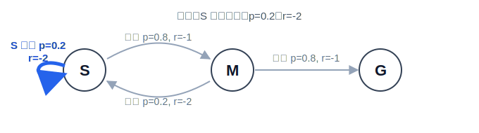
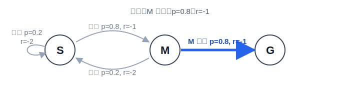
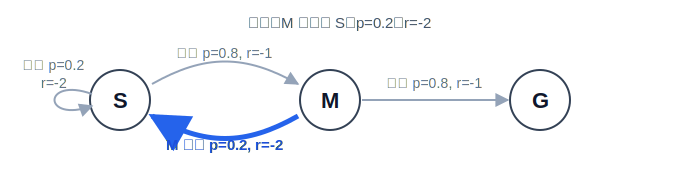

# 3.4 DP、MC、TD：三种价值估计方法

## 本节导读

**核心内容**

- 价值表：在有限状态问题里，先给每个状态存一个当前估计 $V(s)$。
- DP、MC、TD：三种更新价值表的方法，区别在于“目标值”从哪里来。
- TD Error：用“一步真实奖励 + 下一状态表格值”衡量当前格子预测偏差。

上一节讲了 $V^\pi(s)$ 的含义：从状态 $s$ 出发，按策略 $\pi$ 继续走，未来平均能拿多少回报。现在把这个概念落到实现上，它就是一张**价值表**。表里每一行对应一个状态，每个格子里存一个当前估计：

| 状态 | $V(s)$ 的当前估计 |
| ---- | ----------------- |
| $S$  | 0                 |
| $M$  | 0                 |
| $G$  | 0                 |

学习价值函数，本质上就是不断修改这张表。真正的问题不是“价值函数定义是什么”，而是：**每次要把表里的某个数改成什么？**

本节就用“改表”的角度讲 DP、MC、TD。这里先说清一个词：**环境模型**指的是环境规则的数学描述，也就是在状态 $s$ 做动作 $a$ 后，会以什么概率到达各个下一状态 $s'$，以及平均会得到多少奖励。写成符号就是转移概率 $P(s'\mid s,a)$ 和奖励函数 $R(s,a)$。DP 知道这套规则，可以直接用模型算出一个贝尔曼目标；MC 不知道模型，只能等一整局结束，用完整回报改表；TD 也不知道模型，但不用等终点，走一步就用“即时奖励 + 下一状态当前表格值”改表。三种方法估计的是同一张价值表，区别只是更新目标来自哪里。

> 已经知道价值函数应该满足贝尔曼关系以后，怎样在有限状态问题中真正计算这些价值？如果环境模型未知，又能不能只靠采样经验来更新价值？

::: info 核心概念
DP、MC、TD 都是在更新价值表。DP 用已知规则算目标，MC 用整局真实回报算目标，TD 用一步真实奖励和下一格当前估计算目标。
:::

**核心公式**

$$
V_{k+1}(s)
\leftarrow
\sum_a\pi(a\mid s)
\left[
R(s,a)+\gamma\sum_{s'}P(s'\mid s,a)V_k(s')
\right]
\quad \text{（DP 策略评估：已知模型时迭代价值表）}
$$

$$
V(s)\leftarrow V(s)+\alpha\left[G_t-V(s)\right]
\quad \text{（MC 更新：用完整回报修正当前估计）}
$$

$$
V(s)\leftarrow V(s)+\alpha\left[r+\gamma V(s')-V(s)\right]
\quad \text{（TD(0) 更新：走一步后立刻自举更新）}
$$

$$
\delta=r+\gamma V(s')-V(s)
\quad \text{（TD Error：一步贝尔曼目标与旧预测的差）}
$$

> **把公式读成“改表”：**
>
> - $V(s)$：价值表中状态 $s$ 这一格的当前数字。
> - $V_k(s)$：第 $k$ 轮扫表时，状态 $s$ 这一格的旧数字。
> - $P(s'\mid s,a)$、$R(s,a)$：DP 用来算目标的环境规则。
> - $G_t$：MC 等整局结束后看到的完整回报。
> - $r+\gamma V(s')$：TD 走一步后立刻构造的目标。
> - $\alpha$：每次把旧数字往目标值移动多少。
> - $\delta$：TD 目标和旧表格值之间的差。

## 价值表怎么被更新

假设策略 $\pi$ 已经固定。它可能是在走廊里总是向右，也可能是在 GridWorld 里按某个规则选方向。我们暂时不问它是不是最优，只问从每个状态出发继续照它走，平均能拿多少回报。这一步叫**策略评估**（policy evaluation）。

策略评估只填 $V$ 表，不替策略做选择。它回答“按当前策略走，这个状态值多少”。至于“下一步选哪个动作会更好”，那是策略改进的问题；模型已知时可以用 $V$ 做一步前瞻，模型未知时通常要等下一节的 $Q(s,a)$ 才能直接给动作打分。

现在真正要解决的是填表顺序。上一节已经给出最终含义：

$$
V^\pi(s)=\mathbb{E}_\pi[G_t\mid S_t=s],
\qquad
G_t=R_{t+1}+\gamma R_{t+2}+\gamma^2R_{t+3}+\cdots.
$$

它告诉我们 $V^\pi(s)$ 应该等于从 $s$ 出发的平均折扣回报；但一张初始表可能全是 0，定义本身没有说第一步该把哪个格子改成多少。

贝尔曼思想解决的就是这个落地问题[^1]：不要每次重算整个未来，而是把未来拆成“眼前一步奖励”和“下一状态已有的长期估计”。如果下一状态先变准，前面的状态就能被它带动；价值信息因此会沿着轨迹从后往前传播。

所有方法都可以读成同一种改表动作：

$$
V(s)\leftarrow V(s)+\alpha\left[\text{target}-V(s)\right].
$$

$V(s)$ 是旧数字，$\text{target}$ 是这次算出来的目标，$\alpha$ 控制移动幅度。$\alpha=1$ 是直接替换，$\alpha=0.1$ 是只向目标挪 10%。DP、MC、TD 的分歧不在于要不要改表，而在于这个 $\text{target}$ 从哪里来：DP 用已知模型算贝尔曼目标，MC 用完整回报 $G_t$，TD 用一步奖励加下一状态估计 $r+\gamma V(s')$。

先看一个小走廊。它只有三个状态，但已经能体现“按策略平均”这件事：

| 当前状态 | 动作 | 策略概率 | 下一状态 | 奖励 |
| -------- | ---- | -------- | -------- | ---- |
| $S$      | 左走 | 0.2      | $S$      | $-2$ |
| $S$      | 右走 | 0.8      | $M$      | $-1$ |
| $M$      | 左走 | 0.2      | $S$      | $-2$ |
| $M$      | 右走 | 0.8      | $G$      | $-1$ |
| $G$      | 结束 | 1.0      | 无       | $0$  |

这里 $S$ 是起点，$M$ 是中间格，$G$ 是终点，到达终点后结束。向右前进扣 1 分；左走代表走错方向，代价更高，扣 2 分。$S$ 左走会撞墙，仍然留在 $S$；$M$ 左走会回到 $S$。

为了做策略评估，**我们固定一套策略**：**在 $S$ 和 $M$ 都有 $0.8$ 的概率右走、$0.2$ 的概率左走**。它大多数时候朝终点走，但偶尔会退回去。这样一来，$V(M)$ 不再只是“还差一步”，因为从 $M$ 也可能左走回 $S$；$V(S)$ 也不再只是“两步到终点”，因为起点可能先撞墙。

接下来要看的不是直接解出答案，而是从一张初始表出发，怎样把 $V(S)$ 和 $V(M)$ 改到当前策略对应的位置。下面三节分别只追问一件事：在同一张表上，DP、MC、TD 各自怎样构造 $\text{target}$。

## 动态规划

动态规划（dynamic programming, DP）是第一种改表方法：**知道环境规则，直接算目标值**。这里的“知道规则”不是知道最优答案，而是知道每个动作会把智能体带到哪些下一状态、各自概率是多少、这一步平均会得到多少奖励。

因此，DP 不需要先进入环境采样。它可以直接站在规则表外面问一个问题：如果现在在状态 $s$，策略 $\pi$ 可能选择哪些动作？这些动作又可能通向哪些下一状态？每条分支的“一步奖励 + 下一状态价值”是多少？把这些分支按概率平均，就得到这次要写进 $V(s)$ 的目标：

$$
\text{target}_{\mathrm{DP}}(s)=
\sum_a\pi(a\mid s)
\left[
R(s,a)+\gamma\sum_{s'}P(s'\mid s,a)V_k(s')
\right].
$$

这条式子可以按“先看一个动作，再看策略平均”的顺序读：

| 符号 | 含义 |
| ---- | ---- |
| $\text{target}_{\mathrm{DP}}(s)$ | 这一次准备写进状态 $s$ 的新目标值。 |
| $a$ | 在状态 $s$ 可以选择的动作，比如左走、右走。 |
| $\pi(a\mid s)$ | 当前固定策略在状态 $s$ 选择动作 $a$ 的概率。 |
| $R(s,a)$ | 执行动作 $a$ 后，这一步拿到的平均奖励。 |
| $s'$ | 动作之后可能到达的下一状态。 |
| $P(s'\mid s,a)$ | 在状态 $s$ 做动作 $a$ 后，到达 $s'$ 的概率。 |
| $V_k(s')$ | 第 $k$ 轮旧表里，下一状态 $s'$ 的价值估计。 |
| $\gamma$ | 折扣因子，决定下一状态价值要打多少折扣。 |

先看中括号内部：

$$
R(s,a)+\gamma\sum_{s'}P(s'\mid s,a)V_k(s').
$$

它是在问：**如果这一步先做动作 $a$，眼前奖励是多少，后面接上的旧价值平均是多少？** 内层求和 $\sum_{s'}$ 是对环境可能给出的下一状态求平均。

再看外层：

$$
\sum_a\pi(a\mid s)[\cdots].
$$

它是在问：**当前策略会以不同概率选择不同动作，所以这些动作后果也要按策略概率平均。** 这就是 DP 策略评估的目标值。

注意这里没有 $\max_a$。DP 策略评估不是在替智能体选最好的动作，而是在评价已经给定的策略 $\pi$。策略怎么选动作，就照它的概率去平均。

放到这个走廊里看，状态转移本身没有随机性：**选了右走，就去右边**；**选了左走，就按规则撞墙或退回 $S$**。随机性来自策略本身：同一个状态下，它有 $0.8$ 的概率右走，也有 $0.2$ 的概率左走。DP 要评估的是这套策略，所以不能只看“更好的那条路”，而要把两种动作后果按概率混在一起。

取 $\gamma=1$。实际算的时候，先从完整的求和式开始，再把这个走廊里的动作、概率、奖励和下一状态代进去。因为转移是确定的，内层 $\sum_{s'}$ 里只有真正到达的下一状态概率为 1，其他下一状态概率都是 0。比如 **$S$ 右走** 时，只有 $P(M\mid S,\text{右})=1$，所以这一支会留下 $V_{\text{old}}(M)$。

对 $S$ 来说，动作集合只有“右走”和“左走”，所以外层的 $\sum_a$ 会展开成两项：

$$
\begin{aligned}
\text{target}_{\mathrm{DP}}(S)
&=\sum_a\pi(a\mid S)
\left[
R(S,a)+\sum_{s'}P(s'\mid S,a)V_{\text{old}}(s')
\right]\\
&=\pi(\text{右}\mid S)
\left[R(S,\text{右})+P(M\mid S,\text{右})V_{\text{old}}(M)\right]\\
&\quad+\pi(\text{左}\mid S)
\left[R(S,\text{左})+P(S\mid S,\text{左})V_{\text{old}}(S)\right]\\
&=0.8[-1+1\cdot V_{\text{old}}(M)]+0.2[-2+1\cdot V_{\text{old}}(S)].
\end{aligned}
$$

对 $M$ 也是一样，只是右走会到终点 $G$，左走会退回 $S$：

$$
\begin{aligned}
\text{target}_{\mathrm{DP}}(M)
&=\sum_a\pi(a\mid M)
\left[
R(M,a)+\sum_{s'}P(s'\mid M,a)V_{\text{old}}(s')
\right]\\
&=\pi(\text{右}\mid M)
\left[R(M,\text{右})+P(G\mid M,\text{右})V_{\text{old}}(G)\right]\\
&\quad+\pi(\text{左}\mid M)
\left[R(M,\text{左})+P(S\mid M,\text{左})V_{\text{old}}(S)\right]\\
&=0.8[-1+1\cdot V_{\text{old}}(G)]+0.2[-2+1\cdot V_{\text{old}}(S)].
\end{aligned}
$$

也可以把这两个展开式读成一张分支表：

| 要更新的状态 | 右走分支 | 左走分支 | 加权后写入 |
| ------------ | -------- | -------- | ---------- |
| $S$ | $0.8[-1+V_{\text{old}}(M)]$ | $0.2[-2+V_{\text{old}}(S)]$ | 新的 $V(S)$ |
| $M$ | $0.8[-1+V_{\text{old}}(G)]$ | $0.2[-2+V_{\text{old}}(S)]$ | 新的 $V(M)$ |

这张表的读法很直接。下面四张图把对应的线加粗了：

| 分支 | 对应图 |
| ---- | ------ |
| **从 $S$ 右走**：付出 $-1$，到达 $M$ |  |
| **从 $S$ 左走**：付出 $-2$，撞墙并留在 $S$ |  |
| **从 $M$ 右走**：付出 $-1$，到达终点 $G$ |  |
| **从 $M$ 左走**：付出 $-2$，退回 $S$ |  |

每一轮都读旧表，把这些分支的结果按策略概率加权，算出新表。

先从全 0 的旧表开始：

| 初始旧表 | $V(S)$ | $V(M)$ | $V(G)$ |
| -------- | ------ | ------ | ------ |
| 第 0 轮  | 0      | 0      | 0      |

第一轮时，下一状态的长期价值都还是 0，所以目标只剩下眼前动作代价的平均。先从求和展开式写起，再把旧表的数代进去：

$$
\begin{aligned}
V_1(S)
&=\text{target}_{\mathrm{DP}}(S)\\
&=\sum_a\pi(a\mid S)
\left[
R(S,a)+\sum_{s'}P(s'\mid S,a)V_0(s')
\right]\\
&=\pi(\text{右}\mid S)
\left[R(S,\text{右})+P(M\mid S,\text{右})V_0(M)\right]\\
&\quad+\pi(\text{左}\mid S)
\left[R(S,\text{左})+P(S\mid S,\text{左})V_0(S)\right]\\
&=0.8[-1+1\cdot V_0(M)]+0.2[-2+1\cdot V_0(S)]\\
&=0.8(-1+0)+0.2(-2+0)\\
&=-1.2.
\end{aligned}
$$

$$
\begin{aligned}
V_1(M)
&=\text{target}_{\mathrm{DP}}(M)\\
&=\sum_a\pi(a\mid M)
\left[
R(M,a)+\sum_{s'}P(s'\mid M,a)V_0(s')
\right]\\
&=\pi(\text{右}\mid M)
\left[R(M,\text{右})+P(G\mid M,\text{右})V_0(G)\right]\\
&\quad+\pi(\text{左}\mid M)
\left[R(M,\text{左})+P(S\mid M,\text{左})V_0(S)\right]\\
&=0.8[-1+1\cdot V_0(G)]+0.2[-2+1\cdot V_0(S)]\\
&=0.8(-1+0)+0.2(-2+0)\\
&=-1.2.
\end{aligned}
$$

第二轮把第一轮结果当作旧表：

| 第一轮后的旧表 | $V(S)$ | $V(M)$ | $V(G)$ |
| -------------- | ------ | ------ | ------ |
| 第 1 轮        | -1.2   | -1.2   | 0      |

现在每个分支不只包含眼前奖励，还会接上下一状态的旧价值：

$$
\begin{aligned}
V_2(S)
&=\text{target}_{\mathrm{DP}}(S)\\
&=\sum_a\pi(a\mid S)
\left[
R(S,a)+\sum_{s'}P(s'\mid S,a)V_1(s')
\right]\\
&=\pi(\text{右}\mid S)
\left[R(S,\text{右})+P(M\mid S,\text{右})V_1(M)\right]\\
&\quad+\pi(\text{左}\mid S)
\left[R(S,\text{左})+P(S\mid S,\text{左})V_1(S)\right]\\
&=0.8[-1+1\cdot V_1(M)]+0.2[-2+1\cdot V_1(S)]\\
&=0.8[-1+(-1.2)]+0.2[-2+(-1.2)]\\
&=-2.4.
\end{aligned}
$$

$$
\begin{aligned}
V_2(M)
&=\text{target}_{\mathrm{DP}}(M)\\
&=\sum_a\pi(a\mid M)
\left[
R(M,a)+\sum_{s'}P(s'\mid M,a)V_1(s')
\right]\\
&=\pi(\text{右}\mid M)
\left[R(M,\text{右})+P(G\mid M,\text{右})V_1(G)\right]\\
&\quad+\pi(\text{左}\mid M)
\left[R(M,\text{左})+P(S\mid M,\text{左})V_1(S)\right]\\
&=0.8[-1+1\cdot V_1(G)]+0.2[-2+1\cdot V_1(S)]\\
&=0.8(-1+0)+0.2[-2+(-1.2)]\\
&=-1.44.
\end{aligned}
$$

再用第二轮的结果做一次：

| 第二轮后的旧表 | $V(S)$ | $V(M)$ | $V(G)$ |
| -------------- | ------ | ------ | ------ |
| 第 2 轮        | -2.4   | -1.44  | 0      |

$$
\begin{aligned}
V_3(S)
&=\text{target}_{\mathrm{DP}}(S)\\
&=\sum_a\pi(a\mid S)
\left[
R(S,a)+\sum_{s'}P(s'\mid S,a)V_2(s')
\right]\\
&=\pi(\text{右}\mid S)
\left[R(S,\text{右})+P(M\mid S,\text{右})V_2(M)\right]\\
&\quad+\pi(\text{左}\mid S)
\left[R(S,\text{左})+P(S\mid S,\text{左})V_2(S)\right]\\
&=0.8[-1+1\cdot V_2(M)]+0.2[-2+1\cdot V_2(S)]\\
&=0.8[-1+(-1.44)]+0.2[-2+(-2.4)]\\
&=-2.832.
\end{aligned}
$$

$$
\begin{aligned}
V_3(M)
&=\text{target}_{\mathrm{DP}}(M)\\
&=\sum_a\pi(a\mid M)
\left[
R(M,a)+\sum_{s'}P(s'\mid M,a)V_2(s')
\right]\\
&=\pi(\text{右}\mid M)
\left[R(M,\text{右})+P(G\mid M,\text{右})V_2(G)\right]\\
&\quad+\pi(\text{左}\mid M)
\left[R(M,\text{左})+P(S\mid M,\text{左})V_2(S)\right]\\
&=0.8[-1+1\cdot V_2(G)]+0.2[-2+1\cdot V_2(S)]\\
&=0.8(-1+0)+0.2[-2+(-2.4)]\\
&=-1.68.
\end{aligned}
$$

把每轮结束后的价值表放在一起看，数字的变化方向就很清楚了：

| 轮次 | $V(S)$ | $V(M)$ | $V(G)$ |
| ---- | ------ | ------ | ------ |
| 0    | 0      | 0      | 0      |
| 1    | -1.2   | -1.2   | 0      |
| 2    | -2.4   | -1.44  | 0      |
| 3    | -2.832 | -1.68  | 0      |
| 收敛 | -3.375 | -1.875 | 0      |

这个例子比单向走廊更能体现 DP 的含义：它不是只把终点价值向前传，而是在每个状态上计算“按当前策略行动时的平均后果”。右走通常更好，但策略偶尔会左走；这部分绕路和撞墙的代价也必须进入价值表。随着一轮轮更新，$S$ 和 $M$ 的数字逐渐稳定下来，最后得到的不是最优价值，而是这套固定策略本身的价值。

评估完成后，DP 还可以继续做策略改进。此时问题换成：如果在状态 $s$ 先试一个动作 $a$，之后仍然按原策略 $\pi$ 行动，这个动作值多少？在模型已知时，这个动作分数可以直接由 $V^\pi$ 算出来：

$$
Q^\pi(s,a)=R(s,a)+\gamma\sum_{s'}P(s'\mid s,a)V^\pi(s'),
$$

再选动作分数最高的动作：

$$
\pi'(s)=\arg\max_a Q^\pi(s,a).
$$

这就是策略迭代的两步：先评估当前策略，再根据价值表改进策略。需要注意的是，无论评估还是改进，DP 都依赖同一个强前提：环境模型 $P$ 和 $R$ 必须已知。现实中的机器人控制、游戏任务和大模型生成通常没有这样的完整说明书。因此，DP 更像是理论基准：它说明如果知道一切，价值表应该怎样被计算。

## 蒙特卡洛

现在去掉 DP 的关键前提：**环境模型不再已知**。也就是说，下面这些在 DP 里能直接查表的东西，现在都没有了：

| DP 里可以用的信息 | 到了 MC 里还在吗？ | 含义 |
| ----------------- | ------------------ | ---- |
| $P(s'\mid s,a)$ | 没有 | 不知道某个动作会以什么概率到达哪些下一状态。 |
| $R(s,a)$ | 没有 | 不知道某个动作的平均奖励是多少。 |
| $\sum_{s'}P(s'\mid s,a)V(s')$ | 没有 | 不能对所有可能下一状态做模型平均。 |
| $\sum_a\pi(a\mid s)[\cdots]$ | 不直接算 | 策略仍然固定，但我们不再枚举所有动作分支，而是观察策略实际采样出来的动作。 |

还剩下什么？只剩真实交互。智能体进入环境，按照当前策略行动，环境实际给出一个动作结果、一个奖励、一个下一状态。轨迹结束后，我们能看到从某个状态出发以后**实际拿到的整段奖励**。

蒙特卡洛（Monte Carlo, MC）就是第二种改表方法：**不知道规则，就用整局真实回报当目标**[^2]。DP 的目标来自模型平均，MC 的目标来自已经发生的一整条轨迹。

如果某次 episode 中，智能体在时刻 $t$ 访问了状态 $S_t$，那就等这一局结束，把从 $t$ 开始真正拿到的折扣回报算出来：

$$
G_t=R_{t+1}+\gamma R_{t+2}+\gamma^2R_{t+3}+\cdots.
$$

MC 直接把它当成这次访问的目标：

$$
\text{target}_{\mathrm{MC}}=G_t.
$$

多次访问同一个状态后，这些完整回报的平均值会逼近 $V^\pi(s)$。实际写程序时，不一定保存所有历史回报再求平均，也可以让旧值向本次回报移动一步：

$$
V(s)\leftarrow V(s)+\alpha\left[G_t-V(s)\right].
$$

其中 $G_t-V(s)$ 是“这次真实回报”和“表里旧估计”的差。如果这次回报比旧估计高，表格值会上调；如果更低，表格值会下调。

在这个可左右走的走廊里，从 $S$ 出发不再只有一条轨迹。某一局可能很顺利：

$$
S\xrightarrow{-1}M\xrightarrow{-1}G.
$$

也可能先撞墙，或者从 $M$ 左走退回 $S$。比如某次实际采样得到下面这条轨迹：

$$
S\xrightarrow{-2}S\xrightarrow{-1}M\xrightarrow{-2}S\xrightarrow{-1}M\xrightarrow{-1}G.
$$

把它拆开看，每一步对应的线如下：

| 步骤 | 实际发生的一步 | 对应图 |
| ---- | -------------- | ------ |
| 1 | **$S\xrightarrow{-2}S$** |  |
| 2 | **$S\xrightarrow{-1}M$** |  |
| 3 | **$M\xrightarrow{-2}S$** |  |
| 4 | **$S\xrightarrow{-1}M$** |  |
| 5 | **$M\xrightarrow{-1}G$** |  |

MC 的第一步不是马上改表，而是等 episode 结束后，从每次访问的位置往后数回报。取 $\gamma=1$，这条轨迹中每次访问的目标如下：

| 访问位置 | 状态 | 后面实际拿到的奖励 | MC 目标 $G_t$ |
| -------- | ---- | ------------------ | ------------- |
| 第 1 步 | $S$ | $-2,-1,-2,-1,-1$ | $-7$ |
| 第 2 步 | $S$ | $-1,-2,-1,-1$ | $-5$ |
| 第 3 步 | $M$ | $-2,-1,-1$ | $-4$ |
| 第 4 步 | $S$ | $-1,-1$ | $-2$ |
| 第 5 步 | $M$ | $-1$ | $-1$ |

接下来才把这些完整回报代入更新式。初始表全为 0，学习率 $\alpha=0.5$，并采用每次访问都更新的 MC：

| 被更新的状态 | MC 目标 | 旧值 | 新值 |
| ------------ | ------- | ---- | ---- |
| 第 1 次 $S$ | $-7$ | 0 | $0+0.5(-7-0)=-3.5$ |
| 第 2 次 $S$ | $-5$ | -3.5 | $-3.5+0.5[-5-(-3.5)]=-4.25$ |
| 第 1 次 $M$ | $-4$ | 0 | $0+0.5(-4-0)=-2$ |
| 第 3 次 $S$ | $-2$ | -4.25 | $-4.25+0.5[-2-(-4.25)]=-3.125$ |
| 第 2 次 $M$ | $-1$ | -2 | $-2+0.5[-1-(-2)]=-1.5$ |

这两张表也暴露了 MC 的节奏：智能体第一次在 $S$ 撞墙时，还不知道这一局最后会走 5 步还是 20 步，因此不能立刻给 $S$ 算完整回报。它必须等到 episode 结束，再回头给访问过的状态改表。

MC 的优点是目标清晰。$G_t$ 是真实发生的完整回报；在策略固定且采样足够多时，样本平均会收敛到真实期望，所以 MC 目标是无偏的。

它的缺点也来自同一件事。完整回报包含从当前时刻到终止时刻的所有随机性，轨迹越长，回报波动通常越大。如果从同一个状态出发，有时后面一路顺利，有时中途进入坏状态，几次采样得到的 $G_t$ 可能差别很大。为了抵消这种波动，MC 往往需要大量完整轨迹。此外，许多任务没有自然终点，或者一条轨迹非常长，此时等待完整回报会让学习信号来得太晚。

## 时序差分

时序差分（temporal difference, TD）是第三种改表方法：**不知道规则，也不等整局结束，走一步就改表**[^3]。

从 MC 到 TD，又拿掉了一个前提：**不再等待完整回报 $G_t$**。MC 已经不需要环境模型了，但它仍然需要一整条 episode 结束，才能知道从某次访问开始的完整回报。TD 连这一步也省掉，只保留刚刚发生的一步：

| MC 里还需要的信息 | 到了 TD 里还需要吗？ | TD 怎么替代 |
| ----------------- | -------------------- | ----------- |
| 完整回报 $G_t$ | 不需要 | 用一步目标 $r+\gamma V(s')$。 |
| episode 结束 | 不需要 | 每走一步就可以更新。 |
| 从当前时刻到终点的所有奖励 | 不需要 | 只用当前奖励 $r$，后面的部分用旧表里的 $V(s')$ 估计。 |

所以 TD 把 DP 和 MC 各取一半：像 MC 一样使用真实采样到的一步奖励，像 DP 一样借用下一状态表里的价值估计。

智能体在状态 $s$ 做完动作后，会立刻观察到两件事：即时奖励 $r$，以及下一状态 $s'$。完整未来还没发生，但 TD 不等了。它用 $V(s')$ 代表从下一状态开始的后续价值，于是目标变成

$$
\text{target}_{\mathrm{TD}}=r+\gamma V(s').
$$

对应的改表规则是

$$
V(s)\leftarrow V(s)+\alpha\left[r+\gamma V(s')-V(s)\right].
$$

括号里的差值就是 TD 误差（TD error）：

$$
\delta=r+\gamma V(s')-V(s).
$$

它度量了旧预测和一步目标之间差多少。如果 $\delta>0$，表格值偏低；如果 $\delta<0$，表格值偏高；如果 $\delta=0$，这一次采样下的预测和目标一致。

回到同一条采样轨迹：

$$
S\xrightarrow{-2}S\xrightarrow{-1}M\xrightarrow{-2}S\xrightarrow{-1}M\xrightarrow{-1}G.
$$

初始表仍然全为 0，学习率仍取 $\alpha=0.5$。这一次不等整局结束，而是每走一步就改一次。每一行都按同一个模板算：

$$
\text{新值}=\text{旧值}+0.5(\text{TD 目标}-\text{旧值}).
$$

| 步骤 | 对应线 | 实际发生的一步 | 被更新的旧值 | TD 目标 $r+V(s')$ | 写入新值 |
| ---- | ------ | -------------- | ------------ | ----------------- | -------- |
| 1 |  | **$S\xrightarrow{-2}S$** | $V(S)=0$ | $-2+V(S)=-2+0=-2$ | $V(S)=0+0.5(-2-0)=-1$ |
| 2 |  | **$S\xrightarrow{-1}M$** | $V(S)=-1$ | $-1+V(M)=-1+0=-1$ | $V(S)=-1+0.5[-1-(-1)]=-1$ |
| 3 |  | **$M\xrightarrow{-2}S$** | $V(M)=0$ | $-2+V(S)=-2-1=-3$ | $V(M)=0+0.5(-3-0)=-1.5$ |
| 4 |  | **$S\xrightarrow{-1}M$** | $V(S)=-1$ | $-1+V(M)=-1-1.5=-2.5$ | $V(S)=-1+0.5[-2.5-(-1)]=-1.75$ |
| 5 |  | **$M\xrightarrow{-1}G$** | $V(M)=-1.5$ | $-1+V(G)=-1+0=-1$ | $V(M)=-1.5+0.5[-1-(-1.5)]=-1.25$ |

这张表和 MC 的表放在一起看，差别就很直观。MC 要等到最后，先算“从这里到终点一共拿了多少”；TD 每走一步就问“这一步奖励是多少，下一状态表里现在写着多少”。它不需要完整未来，只把刚发生的一步和下一格的当前估计接起来。

这种用已有估计来更新另一个估计的方式称为自举（bootstrapping）。自举使 TD 更新及时、方差较低，但也引入了偏差：如果 $V(s')$ 本身还不准确，$r+\gamma V(s')$ 这个目标也会不准确。实践中，TD 的有效性来自连续修正：随着后继状态估计越来越准，前面状态的估计也被逐步带准。

TD 误差在后续章节会反复出现。Critic 的训练、优势函数的估计、GAE 的构造，都可以看成对 TD 误差的不同使用方式。这里先记住它最基本的含义：TD 误差是价值估计与一步贝尔曼目标之间的差。

## 三种方法的关系

DP、MC 和 TD 都在估计同一个价值函数。它们之间的差别不在于目标概念不同，而在于更新时使用的信息不同。

| 方法 | 是否需要模型 $P,R$ | 是否等待完整轨迹 | 更新目标               | 主要问题                         |
| ---- | ------------------ | ---------------- | ---------------------- | -------------------------------- |
| DP   | 需要               | 不需要           | 对所有可能下一步求期望 | 模型通常不可得，状态空间可能太大 |
| MC   | 不需要             | 需要             | 完整回报 $G_t$         | 学习信号晚，方差大               |
| TD   | 不需要             | 不需要           | $r+\gamma V(s')$       | 目标含估计值，因此有偏差         |

从信息来源看，DP 使用的是“已知规则”，MC 使用的是“完整经历”，TD 使用的是“眼前一步和下一状态估计”。这条变化线很重要：随着我们对环境知道得越来越少，算法逐渐从精确求期望转向采样估计。

在这个固定策略下，三种方法会收敛到同一个状态价值：

$$
V(S)=-3.375,\qquad V(M)=-1.875,\qquad V(G)=0.
$$

但它们走到这个结果的方式不同。DP 不需要真的走一遍，只要知道规则就能迭代计算；MC 需要走完整条轨迹，用总回报回头更新；TD 则在每一步之后立刻更新，并让价值信息逐步向前传播。

这种区别解释了许多后续算法的设计。DQN 和 Actor-Critic 通常采用 TD 类目标，因为它们面对的是没有完整模型的大规模环境，并且不能总是等待完整回报。REINFORCE 更接近 MC，因为它在一条轨迹结束后使用完整回报来更新策略。理解 DP、MC、TD 的关系，就是理解现代强化学习中“模型、采样、偏差和方差”之间的基本取舍。

## 小结

本节讨论了三种价值估计方法。

1. 状态价值 $V^\pi(s)$ 是从状态 $s$ 出发并继续按照策略 $\pi$ 行动时的期望折扣回报。
2. DP 假设环境模型已知，直接使用贝尔曼期望方程对所有动作和下一状态求平均。它适合作为理论基准，但完整模型在现实任务中通常不可得。
3. MC 不需要模型，而是使用完整轨迹的回报 $G_t$ 来更新价值。它的目标无偏，但必须等待 episode 结束，并且方差较大。
4. TD 也不需要模型，并且走一步就能更新。它使用 $r+\gamma V(s')$ 作为目标，学习更及时、方差更低，但因为目标中含有估计值，所以会引入偏差。
5. DP、MC、TD 的共同核心是贝尔曼思想：当前价值可以由即时奖励和未来价值来刻画。它们的差别在于未来价值是由模型精确计算、由完整经历给出，还是由下一状态估计近似。

下一节将从状态价值 $V(s)$ 转向动作价值 $Q(s,a)$。$V(s)$ 只能说明一个状态整体有多好，而 $Q(s,a)$ 可以直接比较“在状态 $s$ 下先做动作 $a$”的好坏，从而让智能体真正做出动作选择。

下一节：[动作价值函数](./value-q)

## 参考文献

[^1]: Bellman, R. (1957). _Dynamic Programming_. Princeton University Press.

[^2]: Metropolis, N., & Ulam, S. (1949). The Monte Carlo method. _Journal of the American Statistical Association_, 44(247), 335-341.

[^3]: Sutton, R. S. (1988). Learning to predict by the methods of temporal differences. _Machine Learning_, 3(1), 9-44.
