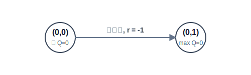

# 3.5 从 Q 到 Q-Learning

## 本节导读

**核心内容**

- **只有 V 表不够用**：没有环境模型时，知道局面好不好并不能帮你做决策。
- **把表扩展一维（Q 表）**：给"每个状态-动作对"单独存一个分数。
- **贝尔曼最优方程**：完美的 Q 表前后两步之间必须满足的递推关系。
- **Q-Learning**：走一步，算一下 TD Target，改一次表。
- **Off-policy 与探索**：一边允许自己随机试错，一边在心里学习最理智的走法。

上一节从"改表"的角度讲了三种价值估计方法。它们的共同目标是同一张**状态价值表** $V(s)$——每个状态存一个数，表示"从这里继续走下去，未来平均能拿多少回报"。三者的区别在于**每次改表时，新的目标值从哪里来**：

- **DP**：环境模型已知，直接用贝尔曼期望方程的右端 $\sum_a \pi(a|s)[R(s,a) + \gamma \sum_{s'} P(s'|s,a) V(s')]$ 作为目标。不需要采样，一轮扫描就更新整张表。
- **MC**：模型未知，但可以等一整局结束，用真实轨迹上的累积回报 $G_t = R_{t+1} + \gamma R_{t+2} + \cdots$ 作为目标。目标是无偏的，但必须等到 episode 终止才能更新。
- **TD**：模型未知，也不用等终点。走一步就用"即时奖励 + 下一状态当前估计" $r + \gamma V(s')$ 作为目标。更新及时，但因为目标中包含了自己的估计，属于自举，会引入偏差。

| 方法 | 模型 | 改表时机 | 更新目标 |
|---|---|---|---|
| **DP** | 已知 | 一轮扫描 | 贝尔曼期望方程右端 |
| **MC** | 未知 | episode 结束后 | 完整回报 $G_t$ |
| **TD** | 未知 | 每走一步 | $r + \gamma V(s')$ |

无论 target 来自模型、完整轨迹还是一步自举，它们都在回答同一个问题：**$V(s)$ 是多少**。

---

上一节花了一整节估计 $V(s)$，但智能体的最终目标不是评价局面，而是**在每个时刻做出动作选择**。$V(s)$ 只告诉你"状态 $s$ 整体值多少"，却不告诉你"在 $s$ 上应该向左还是向右"。换句话说，**$V(s)$ 缺少动作这一维**。

上一节 DP 策略改进的做法是：用 $V^\pi$ 和模型一起算出每个动作的价值，

$$
Q^\pi(s,a) = R(s,a) + \gamma \sum_{s'} P(s'|s,a) \, V^\pi(s'),
$$

再取 $\pi'(s) = \arg\max_a Q^\pi(s,a)$。**但 MC 和 TD 不知道 $P(s'|s,a)$**，上式右端的求和无法计算。即使估计出了准确的 $V^\pi$，也无法转化为动作选择。

---

**解决思路：直接存储动作价值，绕过模型。**

既然从 $V(s)$ 推动作需要模型，而模型又拿不到，那就换一个思路：**不去算 $V(s)$ 再间接推动作，而是直接给每个"状态-动作对"存一个分数**。这个分数就是**动作价值函数** $Q(s,a)$。

- $V(s)$ 是一张"状态 → 价值"的表，回答"这个状态好不好"；
- $Q(s,a)$ 是一张"状态-动作对 → 价值"的表，回答"在这个状态下先做这个动作，好不好"。

有了 $Q(s,a)$，选动作只需在同一行里比大小：

$$
\pi(s) = \arg\max_a Q(s,a).
$$

**无需 $P(s'|s,a)$，无需环境模型。** 这就是 $Q(s,a)$ 的意义：它把"评价状态"和"选择动作"合二为一，让模型未知时的决策成为可能。

剩下的核心问题是：**怎么把这张 Q 表填准？** 这就是 **Q-Learning** 要做的事。它的思路和上一节的 TD 方法一脉相承：每走一步，用"即时奖励 + 下一状态的最优估计"构造一个 target，让当前 $Q(s,a)$ 向这个 target 移动。反复更新后，Q 表逐步逼近贝尔曼最优方程的解，最终收敛到最优策略。

::: info 核心概念
Q-Learning 学的不是一条固定路线，而是一张**动作价值表**。它是状态价值表的进阶版：不再只给每个状态存一个 $V(s)$，而是给每个状态下的每一个动作单独存一个 $Q(s,a)$。
:::

**核心公式**

$$
Q^\pi(s,a)=\mathbb{E}_\pi[G_t\mid S_t=s,A_t=a]
\quad \text{（动作价值函数：先指定动作，再评价未来回报）}
$$

$$
Q^*(s,a) = \mathbb{E}\left[ r+\gamma\max_{a'}Q^*(s',a') \mid s,a \right]
\quad \text{（贝尔曼最优方程：最优 Q 表必须满足的自洽关系）}
$$

$$
Q(s,a) \leftarrow Q(s,a) + \alpha\left[ r+\gamma\max_{a'}Q(s',a')-Q(s,a) \right]
\quad \text{（Q-Learning 更新：用一次交互经验修正动作价值）}
$$

> **三行公式的逻辑链：**
>
> - **第一行**定义了 $Q(s,a)$ 的含义：在状态 $s$ 先执行动作 $a$，此后按策略 $\pi$ 行动，未来回报的期望。
> - **第二行**给出了**目标**：最优 Q 表的每个元素必须满足贝尔曼最优方程，即"一步奖励 + 折扣后的下一步最优价值"的期望。
> - **第三行**给出了**方法**：将贝尔曼最优方程转化为一个更新规则，每次交互后用采样到的一步经验修正 Q 表，逐步逼近第二行的目标。

<span id="q-function"></span>

## 动作价值函数 $Q(s,a)$

上一节的三种方法都在估计 $V(s)$，而 $V(s)$ 只回答"状态好不好"，不回答"动作好不好"。要从 $V(s)$ 推出动作优劣，必须依赖环境模型 $P(s'|s,a)$——MC 和 TD 恰恰没有这个模型。因此需要一张**直接存储动作价值**的表，让选动作不再依赖模型。

动作价值表 $Q(s,a)$ 为每个**状态-动作对**单独赋值：

| 状态 $s$ | 向上走 | 向右走 | 向下走 | 向左走 |
| -------- | ------ | ------ | ------ | ------ |
| $(0,0)$  | -5.1   | -4.6   | -4.6   | -5.2   |
| $(0,1)$  | -4.2   | -3.4   | -3.8   | -4.8   |

有了这张表，决策不需要查模型：当前状态下哪一列的 Q 值最高，就选哪个动作：

$$
\pi^*(s) = \arg\max_a Q^*(s,a).
$$

$Q^\pi(s,a)$ 的数学定义与 $V^\pi(s)$ 类似，但多了一个条件——先指定动作：

$$
Q^\pi(s,a) = \mathbb{E}_\pi [G_t \mid S_t=s, A_t=a].
$$

即在状态 $s$ **先执行动作 $a$**，此后按策略 $\pi$ 继续行动，所获未来回报的期望。与 $V^\pi(s) = \mathbb{E}_\pi[G_t | S_t=s]$ 相比，$Q^\pi(s,a)$ 把"第一个动作"从期望里提了出来，因此可以直接用于比较同一状态下不同动作的好坏。

<span id="bellman-optimal"></span>

## 贝尔曼最优方程

上一节中，$V(s)$ 的更新依赖于贝尔曼期望方程。对于 $Q(s,a)$，对应的方程是**贝尔曼最优方程**：

$$
Q^*(s,a) = \mathbb{E}\left[ r + \gamma \max_{a'} Q^*(s',a') \mid s,a \right].
$$

等式右端是"一步奖励 + 折扣后的下一状态**最优**动作价值"的期望。注意这里的 $\max_{a'}$：它不是按某个固定策略取平均，而是取下一状态上所有动作中的最大值。也就是说，最优 Q 表的每一格，必须等于"执行这一步后，此后每一步都选最优动作"的期望回报。

这个递推关系和上一节 DP 中的贝尔曼期望方程结构相同，但 $\max$ 替代了 $\sum \pi(a|s)$ 的加权平均。它说明：**如果 Q 表已经正确，那么用下一步重新计算出来的结果，应该与表中原来的数值一致。**

Q-Learning 的目标就是通过交互数据，让当前估计逐步逼近这个方程。

<span id="q-learning-update"></span>

## Q-Learning 更新规则

和上一节的 TD 方法一样，Q-Learning 每走一步就更新一次。在状态 $s$ 执行动作 $a$，获得奖励 $r$，转移到下一状态 $s'$。此时手里有两样东西：旧估计 $Q(s,a)$，和一个可以立即算出的新目标。构造 target 的方式和 TD 相同，只是把 $V(s')$ 换成了 $\max_{a'} Q(s',a')$：

$$
\text{target} = r + \gamma \max_{a'} Q(s',a').
$$

这里用 $\max_{a'} Q(s',a')$ 估计下一状态的最优动作价值，属于**自举（bootstrapping）**——用已有估计来构造更新目标，和上一节 TD 的做法一致。

target 与旧估计的偏差为 TD 误差：

$$
\delta = \text{target} - Q(s,a).
$$

按学习率 $\alpha$ 向 target 移动：

$$
Q(s,a) \leftarrow Q(s,a) + \alpha \delta.
$$

合并即得 Q-Learning 的更新公式：

$$
Q(s,a) \leftarrow Q(s,a) + \alpha\left[ r + \gamma \max_{a'} Q(s',a') - Q(s,a) \right].
$$

和上一节的 TD 更新 $V(s) \leftarrow V(s) + \alpha[r + \gamma V(s') - V(s)]$ 相比，唯一的区别是 target 中 $V(s')$ 变成了 $\max_{a'} Q(s',a')$。这意味着 Q-Learning 在更新时，**始终假设下一步会采取最优动作**，而不是按当前行为策略取平均。

<span id="numerical-example"></span>

## 数值示例

以 4×4 GridWorld 为例，每步奖励 $-1$，折扣因子 $\gamma=0.9$，Q 表初始全为 0。智能体在起点 $(0,0)$ 向右走，到达 $(0,1)$，获得 $r=-1$。



更新过程如下：

1. 当前估计：$Q((0,0), \text{右}) = 0$。
2. 下一状态最优估计：$\max_{a'} Q((0,1), a') = 0$（Q 表初始全为 0）。
3. 目标值：$\text{target} = -1 + 0.9 \times 0 = -1$。
4. 更新：$\alpha=0.1$，$Q((0,0), \text{右}) = 0 + 0.1 \times (-1 - 0) = -0.1$。

单次更新幅度很小。但经反复采样，负奖励路径的 Q 值持续下降，最优路径的 Q 值逐步上升。最优策略的信息从终点向起点反向传播，最终填满整张 Q 表。

<span id="code"></span>

## GridWorld 代码实现

以下为不依赖外部 RL 库的 Q-Learning 核心实现。

```python
import numpy as np

rng = np.random.default_rng(0)

N = 4
START = (0, 0)
GOAL = (3, 3)
ACTIONS = [(-1, 0), (0, 1), (1, 0), (0, -1)]  # 上、右、下、左
ARROWS = np.array(["↑", "→", "↓", "←"])

def to_state(pos):
    return pos[0] * N + pos[1]

def to_pos(state):
    return divmod(state, N)

def step(state, action):
    row, col = to_pos(state)
    if (row, col) == GOAL:
        return state, 0, True

    dr, dc = ACTIONS[action]
    next_row = min(max(row + dr, 0), N - 1)
    next_col = min(max(col + dc, 0), N - 1)
    next_state = to_state((next_row, next_col))
    done = (next_row, next_col) == GOAL
    return next_state, -1, done

Q = np.zeros((N * N, len(ACTIONS)))
alpha = 0.1
gamma = 0.9
epsilon0 = 0.3

for episode in range(2000):
    state = to_state(START)
    # 探索率逐渐衰减
    epsilon = max(0.02, epsilon0 * (0.995**episode))

    for _ in range(100):
        # 1. 选动作（探索与利用）
        if rng.random() < epsilon:
            action = int(rng.integers(len(ACTIONS)))
        else:
            best_actions = np.flatnonzero(Q[state] == Q[state].max())
            action = int(rng.choice(best_actions))

        # 2. 和环境交互
        next_state, reward, done = step(state, action)
        
        # 3. 计算 TD Target 并更新 Q 表
        bootstrap = 0 if done else Q[next_state].max()
        target = reward + gamma * bootstrap
        Q[state, action] += alpha * (target - Q[state, action])

        state = next_state
        if done:
            break

print("起点四个动作的 Q 值：")
print(dict(zip(ARROWS, Q[to_state(START)].round(3))))

print("\n学到的一种贪婪策略：")
for row in range(N):
    cells = []
    for col in range(N):
        if (row, col) == GOAL:
            cells.append("G")
        else:
            state = to_state((row, col))
            cells.append(ARROWS[int(Q[state].argmax())])
    print(" ".join(cells))
```

运行结果：

```text
起点四个动作的 Q 值：
{'↑': -4.797, '→': -4.686, '↓': -4.686, '←': -4.919}

学到的一种贪婪策略：
→ ↓ → ↓
↓ → → ↓
→ → → ↓
→ → → G
```

起点向右和向下的 Q 值均为 $-4.686$，对应最短路径（6 步）的折扣回报：

$$
-1 - 0.9 - 0.9^2 - 0.9^3 - 0.9^4 - 0.9^5 = -4.68559.
$$

Q-Learning 没有做任何全局路线规划。它只是每走一步改一次表，最终却拼凑出了全局最优解——和上一节 TD 更新 $V(s)$ 时的收敛过程一致。

<span id="exploration"></span>

## 探索与 Off-policy

上面的代码里有一个上一节没讨论过的问题：如果 Q 表初始全为 0，贪婪地选最大 Q 值的动作会让智能体永远在起点附近打转——所有动作的 Q 值相同，选哪个都一样。即使某个方向碰巧被选到并获得了负奖励，贪婪策略也不会主动去试别的方向。

这就是**探索（Exploration）**问题：必须让智能体有机会尝试尚未充分评估的动作，否则 Q 表的很多格子永远不会被更新。代码中使用了 **$\varepsilon$-贪婪策略**：以概率 $1-\varepsilon$ 选当前最优动作，以概率 $\varepsilon$ 随机选一个动作。$\varepsilon$ 随训练逐步衰减，使早期充分探索、后期逐渐收敛到贪婪策略。

$\varepsilon$-贪婪策略带来一个重要性质：**实际走的策略和 Q 表里假设的策略不一致**。

- **行为策略**：$\varepsilon$-贪婪，允许随机探索；
- **目标策略**：完全贪婪，更新时取 $\max_{a'} Q(s',a')$，假设未来始终选最优动作。

这种**行为策略与目标策略分离**的性质称为 **Off-policy（异策略）**。Q-Learning 在实际探索的同时，学习的是**最优策略**的价值，而非当前行为策略的价值。这个性质在下一节的悬崖行走例子中会有更直观的体现。

<span id="cliff-walking"></span>

## Q-Learning 与 SARSA 的对比：悬崖行走

以悬崖行走（Cliff Walking）说明 Off-policy 与 On-policy 的差异。

```text
.  .  .  .  .  .  .  .  .  .  .  .
.  .  .  .  .  .  .  .  .  .  .  .
.  .  .  .  .  .  .  .  .  .  .  .
S  C  C  C  C  C  C  C  C  C  C  G
```

起点 S 到终点 G 的最短路径沿悬崖边缘（C 为悬崖，掉入奖励 $-100$ 并回到起点，普通步奖励 $-1$）。

**Q-Learning**（Off-policy）更新时使用 $\max_{a'} Q(s',a')$，假设未来始终采取最优动作，因此学到的策略是沿悬崖的最短路径。

**SARSA**（On-policy）的更新目标为 $r + \gamma Q(s', a')$，其中 $a'$ 由当前行为策略（$\varepsilon$-贪婪）实际选出。由于 SARSA 在更新中考虑了探索导致的失误风险，它倾向于学习远离悬崖的安全路径，即使路径更长。

两种算法的差异源于对"未来策略"的不同假设：
- Q-Learning 估计的是**最优策略**的价值，与当前行为策略的探索无关；
- SARSA 估计的是**当前行为策略**的价值，因此会规避探索带来的风险。

这不是谁更好的问题，而是它们回答的问题不同。Q-Learning 回答"如果抛开探索时的随机性，理想最优是什么"；SARSA 回答"带着当前的探索噪声，怎么走最安全"。

<span id="limitations"></span>

## 表格方法的局限

到这里，Q-Learning 似乎已经解决了模型未知时的决策问题：不需要环境模型，不用等整局结束，每走一步就能更新，4×4 GridWorld 上的收敛结果也验证了这一点。

但它有一个根本前提：**状态和动作的数量，必须能被表格装下。**

4×4 GridWorld 只有 16 个状态 × 4 个动作 = 64 个 Q 值。可一旦换成控制机器人，状态包含无数种角度和速度组合，是连续的无限个状态。再换成打游戏，状态是一帧帧图像，像素组合的数量远超存储能力。表格根本存不下。

所以，Q-Learning 的核心更新思想没有过时——用 TD 目标迭代逼近贝尔曼最优方程——过时的是"每个状态-动作对都单独存一行"这件事。第 4 章要解决的正是这个问题：如果表格装不下，能不能用一个神经网络来"近似"整张 Q 表？答案就是深度 Q 网络（DQN）。

上一节：[DP、MC 与 TD](./dp-mc-td) | 下一节：[从价值到策略](./policy-objective)

## 小结

- **动作价值函数 $Q(s,a)$** 为每个状态-动作对赋予价值估计，决策时直接选取最大 Q 值对应的动作，无需环境模型。
- **Q-Learning** 以 TD 目标 $r+\gamma\max_{a'}Q(s',a')$ 更新 Q 表，通过自举逐步逼近贝尔曼最优方程的解。
- **$\varepsilon$-贪婪策略**以概率 $\varepsilon$ 随机探索、以概率 $1-\varepsilon$ 选择当前最优动作，平衡探索与利用。
- **Off-policy**：Q-Learning 的行为策略（$\varepsilon$-贪婪）与目标策略（贪婪）分离，允许在探索的同时学习最优策略。
- 状态空间一旦变大，表格方法就会失效，必须引入函数逼近（深度强化学习）。

## 练习

1. 在 4×4 GridWorld 中，如果 $\gamma=1$，最短路径的回报是多少？如果走了 8 步才到终点，回报又是多少？
2. 如果把奖励改成"到达终点 +10，每走一步 0"，智能体还会偏好最短路吗？为什么？
3. 在 Q-Learning 更新式中，把 $\max_{a'}Q(s',a')$ 换成所有动作的平均值，会产生怎样的策略倾向？
4. 为什么 Q-Learning 可以用旧经验学习，而 SARSA 更依赖当前策略生成的新经验？

## 参考文献

[^1]: Watkins, C. J. C. H. (1989). _Learning from delayed rewards_. PhD thesis, King's College, Cambridge.

[^2]: Watkins, C. J. C. H., & Dayan, P. (1992). Q-learning. _Machine Learning_, 8(3), 279-292.

[^3]: Sutton, R. S., & Barto, A. G. (2018). _Reinforcement Learning: An Introduction_ (2nd ed.). MIT Press.
