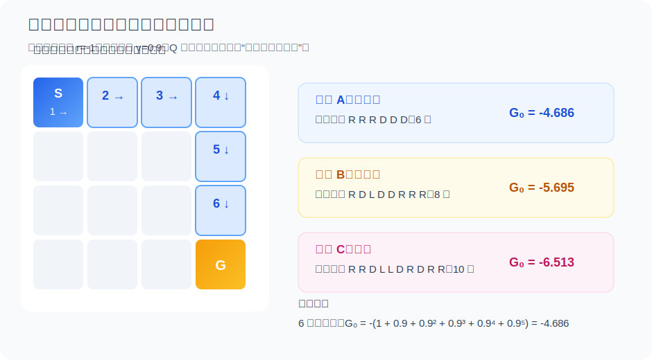
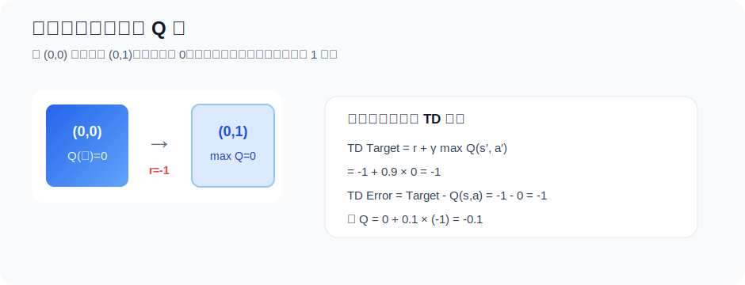
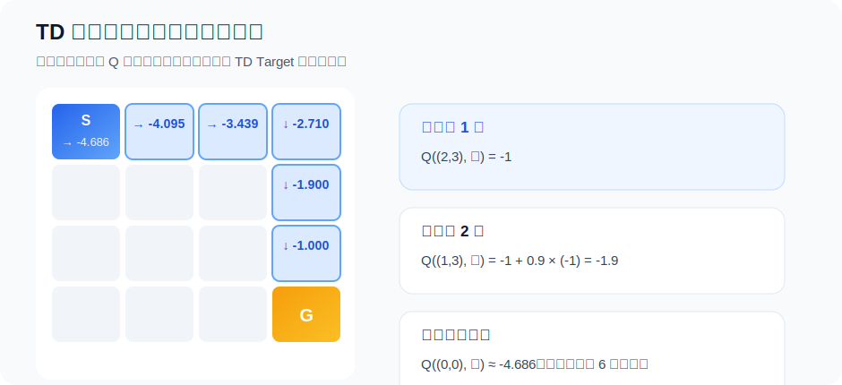
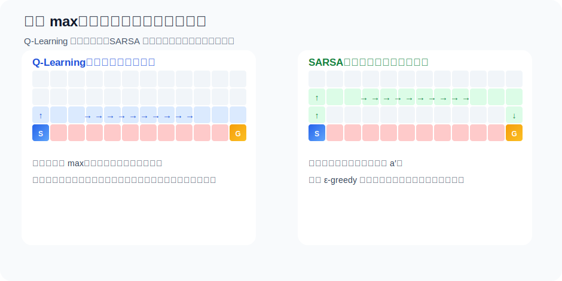

# 3.5 从 Q 到 Q-Learning

## 本节导读

**核心内容**

- 从价值表到 Q 表：把“每个状态一个分数”扩展成“每个状态-动作对一个分数”。
- 贝尔曼最优方程：说明正确的 Q 表应该满足怎样的一步递推关系。
- Q-Learning：不知道环境模型时，用一次真实交互样本构造 TD Target，并逐步修改 Q 表。
- 探索与 Off-policy：训练时允许智能体随机试错，但学习目标仍然指向贪婪最优策略。

第 [3.4 节](./dp-mc-td)讲的是价值表：每个状态存一个 $V(s)$，算法不断修改这张表。价值表能回答“这个状态整体值多少”。但真正做动作选择时，只知道状态整体分数还不够。在同一个格子里，向右和向下可能都能到终点，也可能一个通向近路、另一个通向弯路。

所以这一节直接把表扩展一维：不再只存 $V(s)$，而是为每个状态-动作对存一个 $Q(s,a)$。在 GridWorld 里，$V$ 表是 16 个格子；Q 表是 $16\times4$ 个格子，因为每个位置都有上、右、下、左四个动作。Q 表一旦学好，决策就变成查表：在当前状态这一行里，选择 Q 值最大的动作。

::: info 核心概念
Q-Learning 学的不是一条固定路线，而是一张**动作价值表**。它是价值表的动作版：不再只给每个状态存一个 $V(s)$，而是给每个状态-动作对存一个 $Q(s,a)$。
:::

**核心公式**

$$
Q^\pi(s,a)=\mathbb{E}_\pi[G_t\mid S_t=s,A_t=a]
\quad \text{（动作价值函数：先指定动作，再评价未来回报）}
$$

$$
Q^*(s,a)
=
\mathbb{E}\left[
r+\gamma\max_{a'}Q^*(s',a')
\mid s,a
\right]
\quad \text{（贝尔曼最优方程：定义最优动作价值的自洽关系）}
$$

$$
Q(s,a)
\leftarrow
Q(s,a)
+\alpha\left[
r+\gamma\max_{a'}Q(s',a')-Q(s,a)
\right]
\quad \text{（Q-Learning 更新：用一次交互经验修正动作价值）}
$$

> **本节公式的作用**
>
> 第一行定义 Q 表中每个格子应该表示什么；第二行说明正确的最优 Q 表必须满足什么递推关系；第三行把这个递推关系变成可以从数据中学习的改表规则。理解这三行公式，就能看清 Q-Learning 的核心：**用采样到的一步经验，让整张 Q 表逐渐接近贝尔曼最优方程的解。**

本节直接围绕 Q 表展开：先在 4×4 GridWorld 里看清这张表长什么样，再手算一次更新，最后用一段最小 NumPy 代码把改表过程跑起来。GridWorld 是一个网格环境：每个格子是状态，上、右、下、左是动作，用它可以把每个符号都落到一个具体动作上。

## 一个没有地图的 GridWorld

先把环境说清楚。我们使用最小的 4×4 网格世界，不是因为 Q-Learning 只能解决这么小的问题，而是因为在这个环境里，动作价值表的每一行、每一次更新、每一次探索都能被直接看见：

```text
S  .  .  .
.  .  .  .
.  .  .  .
.  .  .  G
```

$S$ 是起点，$G$ 是终点。每一步可以选择上、右、下、左四个动作；撞墙会留在原地，但这一步仍然扣分。每移动一步得到奖励 $r=-1$，进入终点后 episode 结束，终点之后没有未来奖励。这个奖励设计有一个明确含义：**越快到达终点，累计惩罚越少，回报越高**。

用 MDP 的语言，它可以写成：

| 要素                 | GridWorld 中的含义                       |
| -------------------- | ---------------------------------------- |
| 状态 $\mathcal{S}$   | 16 个格子                                |
| 动作 $\mathcal{A}$   | 上、右、下、左                           |
| 转移 $P(s'\mid s,a)$ | 确定性转移：向右就到右边格子，撞墙则不动 |
| 奖励 $R(s,a,s')$     | 每走一步 $-1$                            |
| 折扣因子 $\gamma$    | 例如 $0.9$，表示越远的分数权重越小       |

最短路径需要 6 步。若 $\gamma=0.9$，沿最短路走到终点的回报为

$$
-1 - 0.9 - 0.9^2 - 0.9^3 - 0.9^4 - 0.9^5
= -4.68559.
$$

绕远路会多扣几次 $-1$，回报更低。因此，这个任务虽然小，却已经有了强化学习的基本味道：当前动作的好坏，不只看眼前这一步的 $-1$，还要看它把我们带到怎样的未来。



这张图里有三条路线。它们都能到达同一个终点，但回报不同：

| 路线 | 步数 | 一种动作序列        | 折扣回报 |
| ---- | ---- | ------------------- | -------- |
| A    | 6    | R R R D D D         | $-4.686$ |
| B    | 8    | R D L D D R R R     | $-5.695$ |
| C    | 10   | R R D L L D R D R R | $-6.513$ |

其中 $R$ 表示向右，$D$ 表示向下，$L$ 表示向左。动作越多，被扣的次数越多；虽然折扣让后面的惩罚权重变小，但多走弯路仍然会让总回报变差。Q-Learning 最后要学出来的，不是一句“去终点”，而是每个格子里每个动作对应的长期后果。也就是说，它要把一张空棋盘变成一张可以查表决策的动作价值表。

## 从“局面好不好”到“动作好不好”

先看表的形状。状态价值表是这样：

| 状态 $s$ | $V(s)$ |
| -------- | ------ |
| $(0,0)$  | ...    |
| $(0,1)$  | ...    |
| $\cdots$ | ...    |

它只有一列分数，所以回答的是“这个状态整体好不好”。Q 表则多了动作这一维：

| 状态 $s$ | 上  | 右  | 下  | 左  |
| -------- | --- | --- | --- | --- |
| $(0,0)$  | ... | ... | ... | ... |
| $(0,1)$  | ... | ... | ... | ... |
| $\cdots$ | ... | ... | ... | ... |

现在每一行不再只有一个分数，而是有四个动作分数。站在同一个格子里，向右和向下可能都能到终点，也可能一个通向近路、另一个通向弯路。真正要比较的是这一行里的四个动作值。

如果我们已经知道环境模型，也就是知道每个动作会以什么概率到达哪个下一个状态，那么确实可以用 $V$ 间接比较动作：先枚举动作，再计算“即时奖励 + 下一状态价值”。但在许多强化学习问题里，环境模型并不公开。智能体只知道自己试了某个动作、看到了什么结果。此时，直接学习 $Q(s,a)$ 更方便，因为它把“动作之后的长期后果”直接存了下来。

Q 表里每个格子的含义由动作价值函数定义：

$$
Q^\pi(s,a)
= \mathbb{E}_\pi [G_t \mid S_t=s, A_t=a].
$$

这句话的意思是：如果现在处在状态 $s$，先执行动作 $a$，之后按照策略 $\pi$ 继续行动，那么从现在开始的累计回报期望是多少。注意这里的“先执行动作 $a$”很关键：它说明 Q 表不是给状态打一个总分，而是给“状态里的某个动作”单独打分。

当策略是最优策略时，我们写成 $Q^*(s,a)$。如果能知道 $Q^*$，决策就非常简单：

$$
\pi^*(s) = \arg\max_a Q^*(s,a).
$$

也就是说，在每个状态这一行里选 Q 值最大的动作。对于 4×4 GridWorld，状态数是 16，动作数是 4，所以 Q 表只有 $16\times 4=64$ 个数，可以直接存下来。

真正的问题在于：这 64 个数一开始全是未知的。和普通价值表一样，我们通常把它们初始化为 0，但这并不表示“所有动作真的都值 0 分”。它只表示智能体还没有经验，暂时不知道每个动作会通向什么后果。

如果已经有 $Q^*$，策略可以通过 $\arg\max$ 得到；但 $Q^*$ 从哪里来？Q-Learning 要补上的就是这个缺口：**不依赖环境模型，只靠一次次交互，把未知的动作价值表学出来。**

## 贝尔曼最优方程：一行公式里的路线规划

先不急着写更新规则。和第 [3.3 节](./value-bellman)一样，我们先问一个更基础的问题：如果 $Q^*$ 已经是正确答案，它应该满足什么关系？这个问题很重要，因为学习算法不是凭空发明公式，而是在寻找一个能让表格逐渐满足的自洽条件。

假设智能体在状态 $s$ 做了动作 $a$，环境给出即时奖励 $r$，并把它带到下一个状态 $s'$。从这一刻起，它已经拿到了 $r$。剩下的事情，是在 $s'$ 里继续选最好的动作。

因此最优动作价值满足：

$$
Q^*(s,a)
= \mathbb{E}\left[
r + \gamma \max_{a'} Q^*(s',a')
\mid s,a
\right].
$$

这里每个符号都有明确的含义：

| 符号                  | 含义                                              |
| --------------------- | ------------------------------------------------- |
| $Q^*(s,a)$            | 在 $s$ 先做 $a$，之后都做最优选择的真实价值       |
| $r$                   | 这一步已经拿到的即时奖励                          |
| $s'$                  | 执行动作后到达的新状态                            |
| $\max_{a'}Q^*(s',a')$ | 到了 $s'$ 之后，下一步能选择的最好动作价值        |
| $\gamma$              | 折扣因子，用来降低未来回报的权重                  |
| $\mathbb{E}[\cdot]$   | 对环境随机性取平均；确定性 GridWorld 中可近似忽略 |

换成白话就是：

> 这一步动作的价值 = 眼前拿到的分数 + 到达新状态后最好未来价值的折扣。

这就是 Q-Learning 的出发点。它不是凭空发明一个更新公式，而是在试图让 Q 表逐渐满足这条贝尔曼最优关系。确定性 GridWorld 中，动作 $a$ 会带到唯一的 $s'$，所以期望看起来不明显；如果环境有随机性，比如同样选择“向右”有时会滑到下方格子，外层期望就会把这些可能结果按概率平均起来。

## 用一次经验修正一次预测

问题是，$Q^*$ 不知道。我们手里只有当前这张还不准确的表 $Q$，以及智能体刚刚从环境里拿到的一条经验。Q-Learning 的做法是：每走一步，就用当前表格构造一个临时目标，然后把旧估计往这个目标挪一点。

一次经验可以写成：

$$
(s,a,r,s').
$$

根据这次经验，Q-Learning 构造 TD 目标：

$$
\text{TD Target}
= r + \gamma \max_{a'} Q(s',a').
$$

它的含义是：“刚才这一步实际得到 $r$，下一状态里当前看来最好的未来价值是 $\max_{a'}Q(s',a')$，所以这一步动作现在应该值这么多。”

这里的 TD Target 不是环境给出的真实标签。它仍然用了当前 Q 表对未来的估计，因此叫做 **bootstrapping**：用一个还在学习中的估计值，去更新另一个估计值。这个做法听起来有点冒险，但正是它让智能体不必等到整局结束就能学习。

旧预测是 $Q(s,a)$。目标和旧预测之间的差距叫 TD Error：

$$
\delta
= r + \gamma \max_{a'} Q(s',a') - Q(s,a).
$$

最后按学习率 $\alpha$ 修正：

$$
Q(s,a)
\leftarrow
Q(s,a) + \alpha \delta.
$$

合在一起就是 Q-Learning 的经典更新式：

$$
Q(s,a)
\leftarrow
Q(s,a)
+ \alpha\left[
r + \gamma \max_{a'}Q(s',a') - Q(s,a)
\right].
$$

这行公式看起来比直觉复杂，但它只做一件事：**走一步，看实际结果和旧预测差多少，然后把表格改一点。** 如果 TD Target 比旧预测高，说明过去低估了这个动作；如果 TD Target 比旧预测低，说明过去高估了这个动作。学习率 $\alpha$ 控制“改一点”的幅度。

这里也能看出它和第 3 章的 Bellman/TD 思想是一脉相承的。[3.3 节](./value-bellman)先说明“长期价值可以递推地写成一步奖励加下一状态价值”，[3.4 节](./dp-mc-td)再把它变成 TD 更新。TD 用

$$
r+\gamma V(s')
$$

修正 $V(s)$；现在我们要学习的是动作价值，所以把下一状态的 $V(s')$ 换成“下一状态中最好的动作价值”：

$$
r+\gamma\max_{a'}Q(s',a').
$$

这一步看似只是把 $V$ 换成 $Q$，但意义很大：TD 原本是在评价状态，现在变成了学习控制策略。

## 手算一次更新

现在回到 GridWorld。假设初始 Q 表全是 0，学习率 $\alpha=0.1$，折扣因子 $\gamma=0.9$。智能体从起点 $(0,0)$ 向右走到 $(0,1)$，这一步奖励 $r=-1$。我们只算这一格里的一个动作，看清楚公式怎样落到表格上。



因为 $(0,1)$ 还没被学过，它的四个动作值暂时都是 0：

$$
\max_{a'}Q((0,1),a') = 0.
$$

于是 TD 目标为：

$$
\text{TD Target}
= -1 + 0.9 \times 0
= -1.
$$

旧预测是：

$$
Q((0,0),\text{右})=0.
$$

因此 TD Error 为：

$$
\delta = -1 - 0 = -1.
$$

更新后：

$$
Q((0,0),\text{右})
\leftarrow
0 + 0.1\times(-1)
= -0.1.
$$

这一步很小，却非常关键。智能体原本以为“从起点向右”值 0 分，现在它知道至少会立刻扣 1 分，于是把这个动作的估计往下调了一点。因为 $\alpha=0.1$，它没有直接把值改成 $-1$，而是先改成 $-0.1$。这相当于说：一次经验只提供一部分证据，表格需要在多次尝试中逐渐稳定。

如果第一局刚好沿最短路走到终点，那么路径上的几个动作都会被更新。靠近终点的动作最先学到比较准确的值；随后，这些信息会在很多 episode 中一层层向前传播。最后，起点附近的动作也会知道“往哪走能更快到终点”。

这和人在陌生楼里找出口很像。第一次走到出口时，你只记住了临近出口的路口怎么走；多走几次后，远处的走廊也逐渐被标上方向。Q 表就是这张逐渐成形的路标图。

## 信息如何从终点传回起点

为了看清“逐层传播”这件事，我们暂时不考虑探索带来的绕路，只假设最短路径固定为

$$
(0,0)\rightarrow(0,1)\rightarrow(0,2)\rightarrow(0,3)
\rightarrow(1,3)\rightarrow(2,3)\rightarrow(3,3).
$$

如果 Q 值已经收敛，离终点越近的动作越容易计算。终点后没有未来价值，所以最后一步是

$$
Q^*((2,3),\text{下})=-1.
$$

再往前一步：

$$
Q^*((1,3),\text{下})
=-1+0.9\times Q^*((2,3),\text{下})
=-1+0.9\times(-1)
=-1.9.
$$

继续向前：

$$
Q^*((0,3),\text{下})
=-1+0.9\times(-1.9)
=-2.71.
$$

沿着同一条最短路反复使用这个关系，起点向右的动作价值最终会变成

$$
Q^*((0,0),\text{右})
= -1 -0.9 -0.9^2 -0.9^3 -0.9^4 -0.9^5
= -4.68559.
$$



注意这不是说智能体真的从终点倒着走。它仍然是从起点出发、一步步和环境交互。只是 TD Target 中含有下一状态的当前估计，所以一旦后面的格子学准了，前面的格子就能借用这些估计来更新自己。第 [3.3 节](./value-bellman)中我们说 Bellman 方程把长期未来压缩成下一状态价值；这里看到的正是这个压缩在 Q 表中的实际传播过程。

这也是 Q-Learning 比“每局结束后再总结整条路径”更高效的地方。它不必等到完整回报 $G_t$ 出现，后面状态的一点进步，会立刻成为前面状态下一次更新时可以利用的信息。

## 用代码跑一个最小版本

下面用 NumPy 实现 4×4 GridWorld 的 Q-Learning。代码不依赖任何强化学习库，方便看清每一步在做什么。你可以把它当成公式的逐行翻译：

- `Q[state, action]` 对应 $Q(s,a)$；
- `target` 对应 $r+\gamma\max_{a'}Q(s',a')$；
- `Q[state, action] += alpha * (...)` 对应把旧预测往 TD Target 挪一步；
- `epsilon` 对应训练时的随机探索。

```python
import numpy as np

rng = np.random.default_rng(0)

N = 4
START = (0, 0)
GOAL = (3, 3)
ACTIONS = [(-1, 0), (0, 1), (1, 0), (0, -1)]  # 上、右、下、左
ARROWS = np.array(["↑", "→", "↓", "←"])


def to_state(pos):
    row, col = pos
    return row * N + col


def to_pos(state):
    return divmod(state, N)


def step(state, action):
    row, col = to_pos(state)
    if (row, col) == GOAL:
        return state, 0, True

    dr, dc = ACTIONS[action]
    next_row = min(max(row + dr, 0), N - 1)
    next_col = min(max(col + dc, 0), N - 1)
    next_state = to_state((next_row, next_col))
    done = (next_row, next_col) == GOAL
    return next_state, -1, done


Q = np.zeros((N * N, len(ACTIONS)))
alpha = 0.1
gamma = 0.9
epsilon0 = 0.3

for episode in range(2000):
    state = to_state(START)
    epsilon = max(0.02, epsilon0 * (0.995**episode))

    for _ in range(100):
        if rng.random() < epsilon:
            action = int(rng.integers(len(ACTIONS)))
        else:
            # 随机打破并列，避免总是选择同一个方向
            best_actions = np.flatnonzero(Q[state] == Q[state].max())
            action = int(rng.choice(best_actions))

        next_state, reward, done = step(state, action)
        bootstrap = 0 if done else Q[next_state].max()
        target = reward + gamma * bootstrap
        Q[state, action] += alpha * (target - Q[state, action])

        state = next_state
        if done:
            break

print("起点四个动作的 Q 值：")
print(dict(zip(ARROWS, Q[to_state(START)].round(3))))

print("\n学到的一种贪婪策略：")
for row in range(N):
    cells = []
    for col in range(N):
        if (row, col) == GOAL:
            cells.append("G")
        else:
            state = to_state((row, col))
            cells.append(ARROWS[int(Q[state].argmax())])
    print(" ".join(cells))
```

先看环境部分。`to_state` 和 `to_pos` 只是把二维格子坐标和一维状态编号互相转换；`step` 则扮演环境的角色：给定当前状态和动作，返回下一状态、奖励和是否结束。真正的学习只发生在循环里的三行：

```python
bootstrap = 0 if done else Q[next_state].max()
target = reward + gamma * bootstrap
Q[state, action] += alpha * (target - Q[state, action])
```

如果下一状态已经是终点，未来价值为 0；否则就查下一状态所有动作里的最大 Q 值。然后用 `reward + gamma * bootstrap` 构造 TD Target，再按学习率更新当前格子。

一种可能输出为：

```text
起点四个动作的 Q 值：
{'↑': -4.797, '→': -4.686, '↓': -4.686, '←': -4.919}

学到的一种贪婪策略：
→ ↓ → ↓
↓ → → ↓
→ → → ↓
→ → → G
```

这里不必纠结每个箭头是否和你的运行结果完全一致。空白 4×4 GridWorld 有很多条同样短的最优路径：先向右再向下可以，先向下再向右也可以。重要的是，起点处向右和向下的 Q 值都接近 $-4.68559$，这正是最短 6 步路径的折扣回报；向上和向左因为会撞墙或绕路，价值更低。

如果你把 `epsilon0` 改成 0，再运行几次，通常会看到学习明显变差。这不是更新公式错了，而是智能体没有足够机会发现其它动作。这就引出了下一节的探索问题。

## 为什么还要探索

到这里还有一个细节没有解决：训练时动作怎么选？Q 表既是学习对象，也是行动依据。问题在于，训练早期这张表几乎全错，如果完全相信它，就会陷入“没试过，所以不知道；不知道，所以不去试”的循环。

如果每次都选当前 Q 值最大的动作，初始表格全是 0，智能体可能会被初始化时的并列规则牵着走。例如 `argmax` 总是返回第一个动作，那么它一开始可能总是尝试“向上”，在左上角不断撞墙。它无法知道右边和下边是否更好，因为它根本没有试过。

因此，Q-Learning 通常配合 $\varepsilon$-贪婪策略收集经验：

$$
a =
\begin{cases}
\arg\max_a Q(s,a), & \text{以概率 } 1-\varepsilon,\\
\text{随机动作}, & \text{以概率 } \varepsilon.
\end{cases}
$$

其中 $1-\varepsilon$ 的部分叫利用：相信当前表格，选择看起来最好的动作。$\varepsilon$ 的部分叫探索：暂时不相信表格，随机试一个动作。

训练早期，表格几乎全错，应该多探索。训练后期，表格已经比较可靠，可以减少探索。因此常见做法是让 $\varepsilon$ 逐渐衰减。例如代码里使用：

$$
\varepsilon_t=\max(0.02,\ 0.3\times 0.995^t).
$$

这表示一开始有 30% 的概率随机探索，后来逐渐降到 2%。这不是 Q-Learning 的数学核心，却是实践中非常重要的工程习惯：**先让智能体见过足够多的路，再让它稳定地走自己认为最好的路。**

从“动手”的角度看，$\varepsilon$ 是你最应该先调的超参数之一。探索太少，Q 表里很多格子永远没有可靠数据；探索太多，训练后期智能体仍然经常乱走，学到的策略看起来不稳定。很多深度强化学习算法的训练曲线起伏很大，背后也常常和探索策略有关。

## Off-policy：学的策略和走的策略可以不同

现在可以解释 Q-Learning 最容易被忽略的一点：它是 **off-policy** 算法。这个词看起来像分类标签，但它其实在回答一个非常具体的问题：**收集数据时实际执行的策略，和算法心里想学的策略，是不是同一个？**

训练时，智能体用 $\varepsilon$-贪婪策略行动。也就是说，它有时会故意乱走，用来探索环境。但 Q-Learning 的更新目标里写的是：

$$
\max_{a'}Q(s',a').
$$

这表示它在学习时假设：“到了下一个状态之后，我会选择最好的动作。”注意，这未必是它实际下一步会做的动作。实际下一步可能因为探索而随机选择。

因此，Q-Learning 的行为策略和学习目标是分开的：

| 角色     | Q-Learning 中的含义                                  |
| -------- | ---------------------------------------------------- |
| 行为策略 | 用 $\varepsilon$-贪婪策略和环境交互，负责收集经验    |
| 目标策略 | 每个状态都选 $\arg\max_a Q(s,a)$，也就是贪婪最优策略 |

换句话说，它一边允许自己在训练时犯错，一边学习“如果以后不犯错，最优应该怎么走”。这就是 off-policy。这个性质非常重要，因为它让 Q-Learning 可以从带探索的数据中学习贪婪最优策略，也为后面 DQN 中的经验回放打下基础：旧经验不一定来自当前最新策略，但仍然可以被拿来更新 Q 函数。

## 和 SARSA 对比：悬崖边上的两种性格

为了看清 off-policy 的含义，我们把 Q-Learning 和 SARSA 放到一个经典场景里比较。

想象一个 4×12 的网格。起点在左下角，终点在右下角，中间一整排都是悬崖：

```text
.  .  .  .  .  .  .  .  .  .  .  .
.  .  .  .  .  .  .  .  .  .  .  .
.  .  .  .  .  .  .  .  .  .  .  .
S  C  C  C  C  C  C  C  C  C  C  G
```

每走一步扣 1 分，掉进悬崖扣 100 分并回到起点。最短路线是贴着悬崖边走：先上去一格，再一路向右，最后向下到终点。它很短，但训练时只要因为探索随机向下走一次，就会掉进悬崖。



SARSA 的更新式是：

$$
Q(s,a)
\leftarrow
Q(s,a)
+ \alpha\left[
r + \gamma Q(s',a') - Q(s,a)
\right].
$$

它和 Q-Learning 只差一个地方：

| 算法       | TD 目标                     | 含义                     |
| ---------- | --------------------------- | ------------------------ |
| Q-Learning | $r+\gamma\max_{a'}Q(s',a')$ | 假设未来会选最好的动作   |
| SARSA      | $r+\gamma Q(s',a')$         | 使用实际下一步选到的动作 |

这个差别在悬崖任务里会产生很不一样的行为。Q-Learning 学的是最优贪婪策略，所以它倾向于贴着悬崖走，因为在“完全不探索”的理想情况下，这条路最短。SARSA 学的是当前 $\varepsilon$-贪婪策略的价值，它知道自己还有概率随机走偏，于是会更偏好离悬崖远一点的安全路线。

这不是谁“更聪明”的问题，而是目标不同：

| 场景                   | 更符合直觉的选择                       |
| ---------------------- | -------------------------------------- |
| 训练结束后几乎不再探索 | Q-Learning 学到的贴边最短路更直接      |
| 训练过程中探索风险很高 | SARSA 的安全路线可能带来更好的实际回报 |
| 安全代价极高的任务     | on-policy 方法的保守性往往更有意义     |

这个例子也提醒我们：公式里的一个 $\max$ 不是装饰。它决定了算法是在学习“理想最优策略”，还是在评估“当前实际会执行的策略”。在工程上，这个选择会影响智能体愿不愿意贴近危险边界、是否会把探索风险计入价值估计，以及训练期间的实际表现。

## Q-Learning 能保证收敛吗

在表格设定下，Q-Learning 有清晰的收敛结论。Watkins 和 Dayan 证明：如果所有状态-动作对都被持续访问，并且学习率满足合适的衰减条件，那么 Q-Learning 会收敛到 $Q^*$。

直觉上，这两个条件分别对应两件事：

1. 每个动作都要有机会被试到。否则表格里某些格子永远是空白的。
2. 学习率不能一直太大。否则后期已经接近正确答案时，还会被新样本剧烈摇动。

实践中我们通常不会真的无限训练，也不一定严格使用理论学习率。但这个结论很重要：它说明 Q-Learning 不是经验主义的凑公式，而是在表格 MDP 中有理论支撑的最优控制算法。

同时也要注意，这个保证说的是**表格设定**。一旦我们把 Q 表换成神经网络，更新一个状态-动作对会通过共享参数影响许多其它状态-动作对，理论性质和训练稳定性都会变得复杂。第 4 章的 DQN 正是在这个边界上继续往前走。

## 表格方法的边界

现在看起来，Q-Learning 已经解决了 GridWorld：不需要环境模型，不用等整局结束，每走一步就能更新；学到 Q 表后，决策也只是查表和取最大值。

但它有一个非常硬的前提：**状态-动作对必须能被表格装下。**

4×4 GridWorld 只有 64 个 Q 值。可是一旦换成 CartPole，状态包含小车位置、速度、杆角和角速度，它们都是连续数值。理论上有无限多个状态。再换成 Atari，状态是一帧帧图像，像素组合的数量远远超过任何表格能表示的规模。

所以，Q-Learning 的核心更新思想没有过时；过时的是“每个状态-动作对都单独存一行”这件事。第 4 章要解决的正是这个问题：如果表格装不下，能不能用一个函数来近似整张 Q 表？答案就是深度 Q 网络。

上一节：[DP、MC 与 TD](./dp-mc-td) | 下一节：[从价值到策略](./policy-objective)

## 小结

- $Q(s,a)$ 表示在状态 $s$ 先做动作 $a$，之后继续行动能得到的累计回报期望。
- 如果知道 $Q^*$，最优策略就是在每个状态选择 $Q$ 值最大的动作。
- Q-Learning 用 TD 目标 $r+\gamma\max_{a'}Q(s',a')$ 修正当前估计。
- $\varepsilon$-贪婪负责在探索和利用之间折中。
- Q-Learning 是 off-policy：用带探索的行为策略收集经验，却学习贪婪最优策略。
- 表格 Q-Learning 适合小规模离散状态空间；状态空间一大，就需要函数逼近，这引出深度 Q 网络。

## 练习

1. 在 4×4 GridWorld 中，如果 $\gamma=1$，最短路径的回报是多少？如果走了 8 步才到终点，回报又是多少？
2. 如果把奖励改成“到达终点 +10，每走一步 0”，智能体还会偏好最短路吗？为什么？
3. 在 Q-Learning 更新式中，把 $\max_{a'}Q(s',a')$ 换成所有动作的平均值，会产生怎样的策略倾向？
4. 为什么 Q-Learning 可以用旧经验学习，而 SARSA 更依赖当前策略生成的新经验？
5. 试着在代码里加入墙壁或陷阱，观察学到的策略如何变化。

## 参考文献

[^1]: Watkins, C. J. C. H. (1989). _Learning from delayed rewards_. PhD thesis, King's College, Cambridge.

[^2]: Watkins, C. J. C. H., & Dayan, P. (1992). Q-learning. _Machine Learning_, 8(3), 279-292.

[^3]: Rummery, G. A., & Niranjan, M. (1994). _On-line Q-learning using connectionist systems_. Technical Report CUED/F-INFENG/TR 166.

[^4]: Sutton, R. S., & Barto, A. G. (2018). _Reinforcement Learning: An Introduction_ (2nd ed.). MIT Press.
