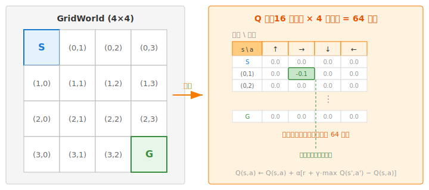
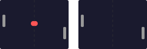
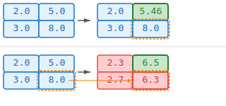

# 4.1 为什么需要深度 Q 网络：Q 表格的局限与神经网络的替代

## 本节导读

**核心内容**

- 回顾 Q-Learning 的更新机制：TD Target、TD Error 和学习率如何协同完成"走一步、改一步"。
- 理解维度灾难为什么让表格方法在高维状态空间中彻底失效。
- 掌握深度 Q 网络用神经网络替代表格的核心动机，以及直接套用会遇到的两大陷阱。

**核心公式**

$$
Q(s, a) \leftarrow Q(s, a) + \alpha \left[ r + \gamma \max_{a'} Q(s', a') - Q(s, a) \right] \quad \text{（Q-Learning 更新规则：用一步经验修正 Q 值）}
$$

> **Q-Learning 更新规则 (Q-Learning Update Rule)：**
>
> - $Q(s, a)$：旧预测——当前表格中状态 $s$ 下动作 $a$ 的分值。
> - $r + \gamma \max_{a'} Q(s', a')$：TD Target，由"已经落袋的即时奖励"和"新局面的最大 Q 值打完折"组成。
> - $\alpha$：学习率，控制每次修正的步长——$\alpha = 1$ 一步到位（容易震荡），$\alpha = 0.1$ 稳扎稳打（收敛慢）。

$$
\text{TD Target} = r + \gamma \max_{a'} Q(s', a') \quad \text{（TD 目标：根据实际奖励与未来估计给出的"应得分"）}
$$

> **TD Target (时序差分目标)：**
>
> - $r$：这一步实际拿到的即时奖励，已经落袋为安的分数。
> - $\gamma \max_{a'} Q(s', a')$：从新状态 $s'$ 出发，选最好的动作能拿多少分，再打一个时间折扣。
> - 两部分相加，回答的问题是："刚走了这步，根据现实和对未来的判断，这个局面应该值多少分？"

$$
\delta = \text{TD Target} - Q(s, a) \quad \text{（TD Error：预测和目标之间的差距，学习的核心信号）}
$$

> **TD Error (时序差分误差)：**
>
> - $\delta > 0$：之前低估了这个局面——实际上比想象的好，应该上调。
> - $\delta < 0$：之前高估了——实际上没那么好，应该下调。
> - $\delta = 0$：预测完全准确，不需要修正。

## Q-Learning 回顾

在第 3.5 节中，我们推导了 Q-Learning 的更新规则。现在把它重新写出来：

$$Q(s, a) \leftarrow Q(s, a) + \alpha \left[ r + \gamma \max_{a'} Q(s', a') - Q(s, a) \right]$$

这行公式在 GridWorld 里到底做了什么？我们把它拆成三步来读。

**第一步，构造一个目标。** 智能体在状态 $s$ 执行了动作 $a$，环境返回奖励 $r$ 并把它送到新状态 $s'$。此时它问自己：这个动作 $a$ 现在应该值多少分？答案是眼下的真实奖励 $r$，加上从 $s'$ 出发能拿到的最好未来回报 $\max_{a'} Q(s', a')$（打个折扣 $\gamma$）。两部分拼在一起，就是这个动作的”应该值”，记作 TD Target。

**第二步，计算差距。** 用 TD Target 减去表格里 $Q(s, a)$ 的当前值。差距为正，说明过去低估了；差距为负，说明过去高估了。这个差距被称为 TD Error，它是 Q-Learning 从每一次交互中提取的学习信号。

**第三步，按比例修正。** 把 $Q(s, a)$ 的旧值往 TD Target 的方向挪一小步，步长由学习率 $\alpha$ 控制。$\alpha = 1$ 就是完全相信这一次经验，一步到位；$\alpha = 0.1$ 就是保守修正，每次只改 10%。

在 4×4 的 GridWorld 中，这张 Q 表只有 16 个状态 × 4 个动作 = 64 个数。



初始时整张表全是 0。智能体每走一步，只改表格里一个格子的一个动作。跑够多轮之后，靠近终点的动作先学准，信息通过 TD Target 中的 $\max_{a'} Q(s', a')$ 一项逐步向前传播，最短路径从这 64 个数字里浮现出来。我们不需要显式地告诉智能体”先向右再向下”——它自己从改表的过程中找到了答案。

这个过程之所以如此简洁，依赖一个从未被明说的前提：**表格装得下所有的状态-动作对。** 每一步更新都要查 $Q(s, a)$ 和 $\max_{a'} Q(s', a')$，在 64 行的表上这是零开销。但如果我们离开 GridWorld 呢？

## 表格的边界

Q 表既是 Q-Learning 的记忆，也是它的边界。只要所有状态-动作对都能枚举出来，查表、更新、取最大值都是 $O(1)$ 的事。一旦枚举不了，”逐格存数”这条路线就走到头了。

我们先看离散状态的情况。猜硬币只有 2 个状态，Q 表 4 行。井字棋约 $3^9 \approx 20{,}000$ 个局面，勉强还能建表。国际象棋约有 $10^{47}$ 种合法局面——已经超过了地球上所有计算机的存储总和。围棋约 $3^{361} \approx 10^{170}$ 种局面，而可观测宇宙中的原子总数也不过 $\sim 10^{80}$ 个。

但这些至少还是离散的——理论上可以穷举。真正的分水岭是连续状态。

CartPole 的状态是 4 维连续向量 $[x, \dot{x}, \theta, \dot{\theta}]$，每个维度都是实数，理论上存在无穷多个不同状态。即便我们把每个维度离散化成 100 个格子，状态总数也有 $100^4 = 10^8$，乘上 2 个动作就是 2 亿行 Q 表。而 CartPole 只是一个入门级的玩具问题。

Atari 游戏更不用提。标准预处理后的输入是 4 帧堆叠的 $84 \times 84$ 灰度图，共 28224 个像素值，每个像素 256 种取值。可能的状态数为 $256^{28224}$——这个数字没有物理意义，因为它远远超出了任何已知系统能够表示的范围。在这种情况下建 Q 表，就像用一把尺子去量银河系：**不是精度不够，而是方法本身就错了。**

这就是强化学习中著名的**维度灾难**（curse of dimensionality）。请特别注意：$r + \gamma \max_{a'} Q(s', a')$ 这个更新规则本身没有问题。它面对连续状态仍然是对的，在数学上最终会收敛到最优 Q 值。卡住的是实现层面：一旦状态多到无法枚举，”每个状态-动作对单独存一个数”就从理所当然变成了根本做不到。在高维状态空间中，那个数学上承诺的”最终”可能是宇宙热寂之后。

我们需要一种不依赖穷举的方法。

## 函数逼近

出路是**函数逼近**（function approximation）。核心思想来自一个朴素的观察：在现实世界中，相似的状态通常有相似的价值。CartPole 中，杆角 5.1° 和杆角 5.2° 的局面，哪个动作更好，答案大概率是一样的。表格方法把每个状态当作独立的实体，完全放弃了这种相似性；函数逼近则反过来利用它。

具体地说，我们不再为每个状态单独存一个数，而是学一个带参数的函数 $f(s; \theta)$，输入状态 $s$，输出价值估计。参数 $\theta$ 的数量是固定的——无论状态空间多大，都只需要存这几百、几千或几百万个数。更重要的是，这个函数有**泛化能力**：训练时没见过的状态，只要和见过的状态相似，就能得到合理的估计值——因为相似的输入在函数中走的是相近的计算路径。

用函数逼近来做强化学习并不是新想法。Sutton 在 1988 年的 TD($\lambda$) 论文中已经讨论了用神经网络作为函数逼近器 [^sutton1988]。1990 年代，Lin [^lin1993] 和 Rummery & Niranjan [^rummery1994] 先后尝试把神经网络和 Q-Learning 结合。但这些早期尝试只能在极小的问题上工作——受限于当时的计算能力、训练稳定性，以及缺乏像 Atari 这样统一且可以大量快速交互的基准环境，它们始终未能证明自己。

真正的突破要等到 2013 年。DeepMind 的 Mnih 等人将函数逼近的思想直接搬到 Q-Learning 上，用神经网络近似 $Q^*(s, a)$：

$$Q(s, a; \theta) \approx Q^*(s, a)$$

这就是**深度 Q 网络**（Deep Q-Network, DQN），名字里的 “Deep” 指的是深度神经网络 [^mnih2013]。

DQN 的架构很直接：网络接收状态 $s$ 作为输入，同时输出所有可能动作的 Q 值——一个输入，多个输出。在 CartPole 中，输入是 4 维状态向量，输出是 2 个 Q 值（左推和右推）。在 Atari 中，输入是 $84 \times 84 \times 4$ 的像素帧，输出是 4 到 18 个 Q 值（取决于游戏有多少个可用动作）。

```mermaid
flowchart LR
    State[“状态 s<br/>（4维向量 / 像素帧）”] --> NN[“神经网络<br/>Q(s, ·; θ)”]
    NN --> Q1[“Q(s, 动作1)”]
    NN --> Q2[“Q(s, 动作2)”]
    NN --> Qn[“Q(s, 动作n)”]

    style State fill:#e3f2fd,stroke:#1976d2,color:#000
    style NN fill:#fff3e0,stroke:#f57c00,color:#000
    style Q1 fill:#e8f5e9,stroke:#388e3c,color:#000
    style Q2 fill:#e8f5e9,stroke:#388e3c,color:#000
    style Qn fill:#e8f5e9,stroke:#388e3c,color:#000
```

神经网络替代表格的好处是根本性的：不再需要为每个状态-动作对单独存一个数，只需要存一组参数。参数数量固定，与状态空间多大无关。而且网络有泛化能力——训练时见过的状态和没见过但相似的状态会得到相近的 Q 值。归结起来，DQN 做了一件事：**保留 Q-Learning 的更新思想，但把”64 行的表格”换成”几万个参数的神经网络”。** 2015 年，这篇论文正式发表在 Nature 上，标志着深度强化学习时代的开端 [^mnih2015]。

## 训练为什么仍然会崩溃

把表格换成神经网络，其他照旧——这个想法听起来很自然。但 DeepMind 的研究者在最初尝试时发现：直接这样做，训练会崩溃。原因有两个，各自致命，叠加起来更糟。

**第一个问题：样本相关。** 在 Atari 游戏中，相邻的帧几乎一模一样。以 Pong 为例，标准预处理后的画面是 $84 \times 84 = 7056$ 个像素，而相邻两帧之间可能只有一个 2×2 的球移动了位置——即仅有约 4 个像素发生变化，**帧间差异不到 0.06%**。如果逐帧采样，一个 batch = 32 的训练样本，实际只覆盖了约 2~3 个真正不同的游戏场景，其余全是同一场景的微小变体。这直接违反了 SGD 的独立同分布假设。



就像一个学生只做同一道题的微小变体，看起来做了很多题，实际上只学到了一种解法。更致命的是梯度的效果：32 个高度相关的样本产生的梯度方向几乎一致，32 个梯度求平均 ≈ 1 个梯度——batch size 被相关性"吃掉"了。梯度会被当前几帧绑架，网络参数在局部打转，始终学不到真正通用的策略。

**第二个问题：目标移动。** 这更隐蔽，也更根本。Q-Learning 的更新目标是 $r + \gamma \max_{a'} Q(s', a')$——注意，这个目标本身就依赖 Q 函数，而 Q 函数正在被更新。网络每次更新参数，它下一步要追逐的目标也跟着变了。就像狗追自己的尾巴：往前扑一步，尾巴也往前移一步，永远追不上。

用一个具体例子就能看清这个恶性循环。假设一个极简问题只有 2 个状态和 2 个动作，$\gamma = 0.99$。当前网络的 Q 值输出为：

$$Q_\theta: \quad Q(s_1, a_1)=2.0,\; Q(s_1, a_2)=5.0,\; Q(s_2, a_1)=3.0,\; Q(s_2, a_2)=8.0$$

现在来了一条经验 $(s_1, a_2, r=+1, s_2)$，Q-Learning 算出 TD Target：

$$\text{TD Target} = r + \gamma \max_{a'} Q_\theta(s_2, a') = 1 + 0.99 \times 8.0 = 8.92$$

Loss = $(Q_\theta(s_1, a_2) - 8.92)^2 = (5.0 - 8.92)^2 = 15.37$。网络做一步梯度下降，把 $Q(s_1, a_2)$ 往上拉。到这里似乎没问题——但真正的陷阱在下一秒：参数 $\theta$ 更新后，**所有的 Q 值都变了**：

$$Q_{\theta'}: \quad Q(s_1, a_1)=2.3,\; Q(s_1, a_2)=6.5,\; Q(s_2, a_1)=2.7,\; Q(s_2, a_2)={\color{red}6.3}$$

注意看 $Q(s_2, a_2)$：更新前是 8.0，更新后掉到了 6.3！我们根本没有训练这个输出，它纯粹被共享参数"拖着"变了。那么下一条经验再算 TD Target 时，$\max_{a'} Q(s_2, a')$ 就从 8.0 变成了 6.3——**目标移动了 1.69。** 于是网络又追新目标，改参数，目标又移动……循环往复。



在表格方法中，这个问题不存在，因为更新是**局部**的。改 $Q(s_1, a_1)$ 这一格，不会影响到 $Q(s_2, a_2)$ 那一格。每个状态-动作对的更新相互独立，下一步的 TD Target 不受影响。但在神经网络中，参数是**全局共享**的——更新一个 $(s,a)$ 对的 Q 值，会连带改变所有其他 $(s,a)$ 对的输出。目标的不稳定被网络共享的参数成倍放大。54 行 Q 表（GridWorld）更新 1 格不影响其他 63 格；几万参数的神经网络改一次，所有状态-动作对的输出都跟着漂。

两个问题叠加在一起，”直接把神经网络套在 Q-Learning 上”这个看似自然的方法在实践中完全不可用。

这就是 DeepMind 真正的贡献所在。他们并没有发明”用神经网络近似 Q 函数”这个想法——如前所述，这个想法 1990 年代就有人试过。他们贡献的是两个精巧的工程方案，分别精准地解决上述两个问题：**经验回放**（experience replay）打散样本相关性，**目标网络**（target network）冻结出一个稳定的优化目标。有了这两个组件，DQN 才真正能在 Atari 上训练出超越人类的策略。

<details>
<summary>思考题：1990 年代就有人尝试神经网络 Q-Learning，为什么直到 2013 年才成功？</summary>

三个原因。第一，GPU 算力——1990 年代的硬件无法支撑在像素级输入上训练深度网络。第二，经验回放和目标网络这两个稳定训练的技巧在当时还没有被发现——没有它们，神经网络参数会迅速发散。第三，基准环境——Atari 模拟器（Arcade Learning Environment）直到 2013 年才被开发出来，在此之前没有一个统一、可以大量快速交互的游戏环境来检验算法。

</details>

接下来，我们逐项拆解 DQN 的三个核心组件：[Q 网络、经验回放和目标网络](./dqn-components)。

## 参考文献

[^sutton1988]: Sutton, R. S. (1988). Learning to predict by the methods of temporal differences. _Machine Learning_, 3(1), 9-44.

[^lin1993]: Lin, L.-J. (1993). _Reinforcement learning for robots using neural networks_. PhD thesis, Carnegie Mellon University.

[^rummery1994]: Rummery, G. A., & Niranjan, M. (1994). _On-line Q-learning using connectionist systems_. Technical Report CUED/F-INFENG/TR 166, Cambridge University.

[^mnih2013]: Mnih, V., et al. (2013). Playing Atari with deep reinforcement learning. _arXiv preprint_, arXiv:1312.5602.

[^mnih2015]: Mnih, V., et al. (2015). Human-level control through deep reinforcement learning. _Nature_, 518(7540), 529-533.
