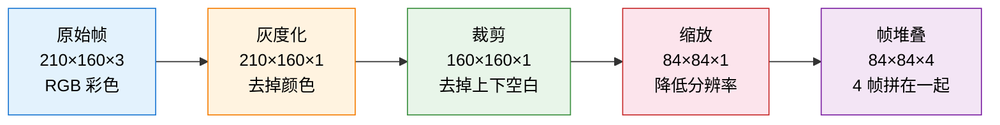
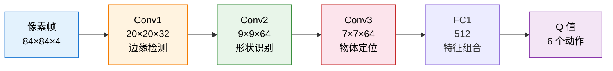

# 4.7 项目：DQN 实战——从 CartPole 到视觉游戏

前面我们理清了 DQN 的理论框架和三个核心组件。现在把它变成代码，并一步步迁移到更复杂的环境。这一页按难度递进排列四个项目：CartPole 是入门，Atari 引入像素输入，ViZDoom 引入部分可观测，宝可梦则是稀疏奖励和长时规划的终极挑战。它们不是四套互不相关的算法，而是同一套 DQN 思维在不同环境压力下的四次放大。

## 项目路线

| 项目                | 主要变化                    | 你要关注的问题                                     |
| ------------------- | --------------------------- | -------------------------------------------------- |
| CartPole            | 从零实现 DQN 的每个组件     | Q-Network、经验回放、目标网络怎么搭？              |
| Atari Pong          | 4 维状态变成像素帧          | CNN、图像预处理、帧堆叠如何接入 DQN？              |
| ViZDoom             | 2D 上帝视角变成 3D 第一人称 | 部分可观测和导航复杂度如何改变训练难度？           |
| stable-retro 宝可梦 | 短局游戏变成长时程 RPG      | 稀疏奖励、动作组合和长期规划为什么会压垮朴素 DQN？ |

## 4.7.1 动手：用 DQN 玩 CartPole

我们选择 CartPole 作为入门项目——和第 1 章不同的是，当时我们用 Stable Baselines3 的黑盒 `PPO("MlpPolicy", env)` 一行完成训练，无需了解内部实现。现在，我们要用从第 3 章一路学来的知识，亲手搭建 DQN 的每一个组件。

为什么先从 CartPole 开始？因为它的输入是 4 维向量，一个简单的 MLP 就能处理，让我们把精力集中在 DQN 算法本身。等理解了 CartPole 上的 DQN，后面迁移到 Atari 只需要换网络结构和预处理流程。

### CartPole 长什么样？

一根杆子铰接在小车上，杆子初始时接近直立。你可以控制小车向左或向右施加推力。目标很简单：让杆子尽可能久地保持直立不倒。

```
训练前（Episode 1）               训练后（Episode 300）

    |  ← 杆子立刻倒下                |||||||  ← 杆子稳稳直立
    |                               |||||||
   /                               |||||||
  ┌───┐                            ┌───┐
  │   │  ← 小车乱动                │   │ ← 小车精准微调
──┴───┴──                        ──┴───┴──
─────────────                    ────────────

奖励：9.4 步就倒下                 奖励：500 步（满分）
```

CartPole 的状态有 4 个维度：

| 状态分量   | 符号           | 含义                   | 直觉                       |
| ---------- | -------------- | ---------------------- | -------------------------- |
| 小车位置   | $x$            | 小车在轨道上的水平位置 | "车在轨道中间还是偏了"     |
| 小车速度   | $\dot{x}$      | 小车的水平移动速度     | "车在往哪边溜"             |
| 杆子角度   | $\theta$       | 杆子偏离竖直方向的角度 | "杆子歪了多少"             |
| 杆子角速度 | $\dot{\theta}$ | 角度的变化速率         | "杆子在往哪边倒、倒得多快" |

每个时间步，智能体只能做一个选择——向左推或者向右推。杆子保持直立每步得 +1 分，杆子倒下（角度超过 $\pm 12°$）或者小车滑出屏幕就游戏结束。满分 500。

### 完整代码：从零实现 DQN

#### 第一部分：Q-Network 和经验回放

```python
import random
from collections import deque

import gymnasium as gym
import numpy as np
import torch
import torch.nn as nn
import torch.optim as optim

# ==========================================
# 1. Q-Network：输入状态，输出每个动作的 Q 值
# ==========================================
class QNetwork(nn.Module):
    def __init__(self, state_dim, action_dim, hidden_dim=128):
        super().__init__()
        self.net = nn.Sequential(
            nn.Linear(state_dim, hidden_dim),
            nn.ReLU(),
            nn.Linear(hidden_dim, hidden_dim),
            nn.ReLU(),
            nn.Linear(hidden_dim, action_dim)
        )

    def forward(self, x):
        return self.net(x)

# ==========================================
# 2. 经验回放池
# ==========================================
class ReplayBuffer:
    def __init__(self, capacity=10000):
        self.buffer = deque(maxlen=capacity)

    def push(self, state, action, reward, next_state, done):
        self.buffer.append((state, action, reward, next_state, done))

    def sample(self, batch_size):
        batch = random.sample(self.buffer, batch_size)
        states, actions, rewards, next_states, dones = zip(*batch)
        return (torch.FloatTensor(np.array(states)),
                torch.LongTensor(actions),
                torch.FloatTensor(rewards),
                torch.FloatTensor(np.array(next_states)),
                torch.FloatTensor(dones))

    def __len__(self):
        return len(self.buffer)
```

Q-Network 是一个简单的三层 MLP：4 维输入 → 128 隐藏 → 128 隐藏 → 2 维输出。经验回放池用 `deque` 实现，容量 10000 条——超过容量后旧经验自动淘汰。

#### 第二部分：DQN 智能体

```python
# ==========================================
# 3. DQN 智能体
# ==========================================
class DQNAgent:
    def __init__(self, state_dim, action_dim, lr=1e-3, gamma=0.99,
                 epsilon_start=1.0, epsilon_end=0.01, epsilon_decay=500,
                 buffer_capacity=10000, batch_size=64, target_update=10):
        self.state_dim = state_dim
        self.action_dim = action_dim
        self.gamma = gamma
        self.batch_size = batch_size
        self.target_update = target_update

        # ε-贪婪策略：ε 从 1.0 线性衰减到 0.01
        self.epsilon_start = epsilon_start
        self.epsilon_end = epsilon_end
        self.epsilon_decay = epsilon_decay
        self.steps_done = 0

        # Q-Network 和目标网络
        self.q_net = QNetwork(state_dim, action_dim)
        self.target_net = QNetwork(state_dim, action_dim)
        self.target_net.load_state_dict(self.q_net.state_dict())
        self.target_net.eval()

        # 优化器和损失函数
        self.optimizer = optim.Adam(self.q_net.parameters(), lr=lr)
        self.loss_fn = nn.MSELoss()

        # 经验回放池
        self.buffer = ReplayBuffer(capacity=buffer_capacity)

    def select_action(self, state):
        """ε-贪婪策略选择动作"""
        epsilon = self.epsilon_end + (self.epsilon_start - self.epsilon_end) * \
                  np.exp(-self.steps_done / self.epsilon_decay)
        self.steps_done += 1

        if random.random() < epsilon:
            return random.randint(0, self.action_dim - 1)
        else:
            with torch.no_grad():
                state_tensor = torch.FloatTensor(state).unsqueeze(0)
                q_values = self.q_net(state_tensor)
                return q_values.argmax().item()

    def update(self):
        """从经验回放池采样并更新 Q-Network"""
        if len(self.buffer) < self.batch_size:
            return 0.0

        states, actions, rewards, next_states, dones = self.buffer.sample(self.batch_size)

        q_values = self.q_net(states).gather(1, actions.unsqueeze(1)).squeeze(1)

        with torch.no_grad():
            next_q_max = self.target_net(next_states).max(dim=1)[0]
            td_target = rewards + self.gamma * next_q_max * (1 - dones)

        loss = self.loss_fn(q_values, td_target)
        self.optimizer.zero_grad()
        loss.backward()
        self.optimizer.step()

        return loss.item()

    def update_target(self):
        """将 Q-Network 的参数复制到目标网络"""
        self.target_net.load_state_dict(self.q_net.state_dict())
```

`select_action` 使用 $\varepsilon$-贪婪策略，$\varepsilon$ 按指数衰减——训练初期 $\varepsilon \approx 1$ 几乎纯随机探索，后期 $\varepsilon \approx 0.01$ 几乎完全利用。`update` 中的 `.gather(1, actions.unsqueeze(1))` 从所有动作 Q 值中取出实际执行的那个，`(1 - dones)` 处理 episode 结束时没有"下一状态"的情况。

#### 第三部分：训练循环

```python
# ==========================================
# 4. 训练循环
# ==========================================
env = gym.make("CartPole-v1")
agent = DQNAgent(state_dim=4, action_dim=2)

num_episodes = 300
reward_history = []

for episode in range(num_episodes):
    state, _ = env.reset()
    total_reward = 0

    while True:
        action = agent.select_action(state)
        next_state, reward, terminated, truncated, _ = env.step(action)
        done = terminated or truncated
        total_reward += reward

        agent.buffer.push(state, action, reward, next_state, float(done))
        agent.update()

        if agent.steps_done % agent.target_update == 0:
            agent.update_target()

        state = next_state
        if done:
            break

    reward_history.append(total_reward)
    if (episode + 1) % 50 == 0:
        avg = np.mean(reward_history[-50:])
        print(f"Episode {episode+1}/{num_episodes} | "
              f"最近50轮平均奖励: {avg:.1f} | ε: "
              f"{agent.epsilon_end + (agent.epsilon_start - agent.epsilon_end) * np.exp(-agent.steps_done / agent.epsilon_decay):.3f}")

env.close()
```

### 预期输出

```
Episode 50/300 | 最近50轮平均奖励: 22.5 | ε: 0.741
Episode 100/300 | 最近50轮平均奖励: 85.3 | ε: 0.301
Episode 150/300 | 最近50轮平均奖励: 182.7 | ε: 0.089
Episode 200/300 | 最近50轮平均奖励: 312.4 | ε: 0.023
Episode 250/300 | 最近50轮平均奖励: 415.8 | ε: 0.011
Episode 300/300 | 最近50轮平均奖励: 465.2 | ε: 0.010
```

前 50 轮平均奖励很低（~22），智能体几乎无法保持平衡。随着探索减少、经验积累，200 轮左右突破 300 分，300 轮时接近满分。

### 测试训练好的智能体

```python
test_env = gym.make("CartPole-v1")
state, _ = test_env.reset()
total_reward = 0

while True:
    with torch.no_grad():
        state_tensor = torch.FloatTensor(state).unsqueeze(0)
    action = agent.q_net(state_tensor).argmax().item()
    state, reward, terminated, truncated, _ = test_env.step(action)
    total_reward += reward
    if terminated or truncated:
        break

test_env.close()
print(f"\n测试得分: {total_reward}")
```

测试时关闭探索——直接选 Q 值最大的动作。如果训练成功，测试得分应该接近 CartPole 的满分 500。

这个学习过程和第 1 章用 SB3 的 PPO 看到的现象本质上是一样的——只是现在你能看到每一个零件在做什么。经验回放池里的每一条经验长什么样？目标网络多久更新一次？Q 值是怎么从随机噪声变成有意义的评估？这些在第 1 章都是黑盒，现在全部透明。

## 4.7.2 从像素学玩 Atari

2015 年 2 月，Nature 杂志的封面上印着一张 Atari 游戏的截图。那篇论文的标题叫"Human-level control through deep reinforcement learning"——通过深度强化学习实现人类水平的控制。DeepMind 展示了一个程序：它只看屏幕上的像素和游戏得分，就从头学会了玩 29 种 Atari 游戏，其中近一半达到了人类专业玩家的水平。没有任何人工特征工程，没有任何游戏规则输入——纯粹的"从像素到决策"。

上一节我们在 CartPole 上用 MLP 跑通了 DQN——4 个数字输入，一个简单网络即可处理。但真正让 DQN 名声大噪的，是它处理像素级输入的能力。这一节，我们跨越从 4 维向量到 28,000 维像素帧的鸿沟，用 CNN-DQN 学玩 Atari Pong。

### 从 CartPole 到 Atari：什么变了？

|            | CartPole          | Atari Pong                         |
| ---------- | ----------------- | ---------------------------------- |
| 输入       | 4 维连续向量      | 84×84×4 像素帧（28,224 维）        |
| 网络结构   | MLP（全连接）     | CNN（卷积 + 全连接）               |
| 动作空间   | 2 个（左推/右推） | 6 个（实际上只有上、下、不动有效） |
| 回放池大小 | 10,000            | 通常 100,000                       |
| 训练时间   | 几分钟（CPU）     | 数小时（需要 GPU）                 |
| 预处理     | 无                | 灰度化 + 裁剪 + 缩放 + 帧堆叠      |

最显著的变化是输入维度——从 4 个数字变成超过 28,000 个数字。全连接网络处理不了这么高维的输入，我们需要卷积神经网络（CNN）来从像素中提取有用的特征。

### 图像预处理：从 210×160 到 84×84×4

原始的 Atari 画面是 210×160 的 RGB 彩色图，每帧有 $210 \times 160 \times 3 = 100{,}800$ 个数值。直接喂给网络太大了，而且包含大量无用信息。DeepMind 设计了一套预处理流水线：



**灰度化**：颜色对大多数 Atari 游戏的策略没有影响——不管球是白色的还是蓝色的，你都得接住它。去掉颜色，数据量直接减少到三分之一。

**裁剪**：Atari 画面的上下方有固定的 UI 元素（分数显示、游戏边框），对决策没有帮助。裁掉这些区域，只保留游戏区域。

**缩放**：缩放到 84×84 大大减少了计算量，同时保留了足够的空间信息。

**帧堆叠**：这是最关键的一步。单帧画面无法传达运动信息——你只看一张静态图片，无法判断球是往左飞还是往右飞。把连续 4 帧堆叠在一起（84×84×4），网络就能从帧间的位置变化推断出运动方向和速度。这等价于给智能体加了一个"短期记忆"。

```
帧堆叠示意（以 Pong 为例）：

帧 t-3        帧 t-2        帧 t-1        帧 t
  ●            ●             ●             ●
  ┃             ┃             ┃             ┃     ← 球的位置逐帧变化
 ▮             ▮             ▮             ▮        让网络推断球的方向

→ 拼在一起变成 84×84×4 的张量，作为 CNN 的输入
```

Gymnasium 提供了现成的预处理包装器：

```python
import gymnasium as gym

def make_atari_env(game_id="ALE/Pong-v5"):
    """创建预处理的 Atari 环境"""
    env = gym.make(game_id)
    env = gym.wrappers.AtariPreprocessing(
        env, grayscale_new=True, scale_obs=True, frame_skip=4
    )
    env = gym.wrappers.FrameStack(env, num_stack=4)
    return env

env = make_atari_env()
state, _ = env.reset()
print(f"状态空间: {state.shape}")  # (4, 84, 84)
print(f"动作空间: {env.action_space.n}")  # 6
```

安装 Atari 环境：`pip install "gymnasium[atari,accept-rom-license]"`

### CNN Q-Network：用卷积层"看懂"画面

为什么用 CNN 而不是 MLP？MLP 把输入展平成一维向量，丢失了图像的空间结构——它不知道相邻的像素在画面上是挨在一起的。CNN 通过卷积核在图像上滑动，自动学习局部特征（边缘、形状、物体），然后逐层组合成更高级的语义。这正是计算机视觉中 CNN 擅长的事情。

DeepMind 原始论文中的 CNN 架构：

```python
import torch
import torch.nn as nn

class CNNQNetwork(nn.Module):
    """DeepMind 原始 DQN 的 CNN 架构"""

    def __init__(self, input_channels=4, num_actions=6):
        super().__init__()
        self.conv = nn.Sequential(
            nn.Conv2d(input_channels, 32, kernel_size=8, stride=4),  # → 20×20×32
            nn.ReLU(),
            nn.Conv2d(32, 64, kernel_size=4, stride=2),              # → 9×9×64
            nn.ReLU(),
            nn.Conv2d(64, 64, kernel_size=3, stride=1),              # → 7×7×64
            nn.ReLU(),
        )
        self.fc = nn.Sequential(
            nn.Linear(64 * 7 * 7, 512),
            nn.ReLU(),
            nn.Linear(512, num_actions)
        )

    def forward(self, x):
        x = x / 255.0  # 归一化
        conv_out = self.conv(x)
        conv_out = conv_out.view(conv_out.size(0), -1)
        return self.fc(conv_out)
```

逐层拆解这个网络在做什么：

| 层    | 输入尺寸 | 操作                     | 输出尺寸 | 它在学什么                                 |
| ----- | -------- | ------------------------ | -------- | ------------------------------------------ |
| Conv1 | 84×84×4  | 32 个 8×8 卷积核，步幅 4 | 20×20×32 | 大尺度边缘和明暗变化（球拍轮廓、球的形状） |
| Conv2 | 20×20×32 | 64 个 4×4 卷积核，步幅 2 | 9×9×64   | 中尺度特征（球拍+球的组合、球的方向）      |
| Conv3 | 9×9×64   | 64 个 3×3 卷积核，步幅 1 | 7×7×64   | 精细特征（球和球拍的精确位置关系）         |
| FC1   | 3136     | 全连接 512               | 512      | 组合所有特征做出全局判断                   |
| FC2   | 512      | 全连接 6                 | 6        | 输出 6 个动作的 Q 值                       |

前三层卷积做的事情就像人类的视觉皮层：第一层识别边缘和明暗，第二层组合边缘成形状，第三层识别出物体。后面的全连接层则像一个决策大脑："球往右上方飞，我的球拍在下面，所以我应该向上移动。"



### 完整训练代码

上一节的 `ReplayBuffer` 大部分可以复用，主要变化是网络结构、环境预处理和几个超参数：

```python
import random
from collections import deque
import numpy as np
import torch.optim as optim

class ReplayBuffer:
    def __init__(self, capacity=100000):
        self.buffer = deque(maxlen=capacity)

    def push(self, state, action, reward, next_state, done):
        self.buffer.append((state, action, reward, next_state, done))

    def sample(self, batch_size):
        batch = random.sample(self.buffer, batch_size)
        states, actions, rewards, next_states, dones = zip(*batch)
        return (torch.FloatTensor(np.array(states)),
                torch.LongTensor(actions),
                torch.FloatTensor(rewards),
                torch.FloatTensor(np.array(next_states)),
                torch.FloatTensor(dones))

    def __len__(self):
        return len(self.buffer)

device = torch.device("cuda" if torch.cuda.is_available() else "cpu")
q_net = CNNQNetwork(input_channels=4, num_actions=6).to(device)
target_net = CNNQNetwork(input_channels=4, num_actions=6).to(device)
target_net.load_state_dict(q_net.state_dict())

optimizer = optim.Adam(q_net.parameters(), lr=1e-4)
buffer = ReplayBuffer(capacity=100000)

gamma = 0.99
batch_size = 32
epsilon_start, epsilon_end, epsilon_decay = 1.0, 0.02, 1000000
target_update = 10000
total_steps = 0
reward_history = []

for episode in range(500):
    state, _ = env.reset()
    total_reward = 0

    while True:
        epsilon = max(epsilon_end, epsilon_start - total_steps / epsilon_decay)
        if random.random() < epsilon:
            action = env.action_space.sample()
        else:
            with torch.no_grad():
                action = q_net(torch.FloatTensor(state).unsqueeze(0).to(device)).argmax().item()

        next_state, reward, terminated, truncated, _ = env.step(action)
        done = terminated or truncated
        total_reward += reward
        reward = np.clip(reward, -1, 1)  # 奖励裁剪

        buffer.push(state, action, reward, next_state, float(done))
        state = next_state
        total_steps += 1

        if len(buffer) >= batch_size:
            s, a, r, ns, d = buffer.sample(batch_size)
            s, ns = s.to(device), ns.to(device)
            q_values = q_net(s).gather(1, a.unsqueeze(1).to(device)).squeeze(1)
            with torch.no_grad():
                td_target = r.to(device) + gamma * target_net(ns).max(dim=1)[0] * (1 - d.to(device))
            loss = nn.MSELoss()(q_values, td_target)
            optimizer.zero_grad()
            loss.backward()
            torch.nn.utils.clip_grad_norm_(q_net.parameters(), 10)  # 梯度裁剪
            optimizer.step()

        if total_steps % target_update == 0:
            target_net.load_state_dict(q_net.state_dict())

        if done:
            break

    reward_history.append(total_reward)
    if (episode + 1) % 50 == 0:
        avg = np.mean(reward_history[-50:])
        print(f"Episode {episode+1} | Avg Reward: {avg:.1f} | ε: {epsilon:.3f} | Steps: {total_steps}")

env.close()
```

和 CartPole 的 DQN 相比，关键差异在于：网络从 MLP 换成 CNN；回放池从 10,000 扩大到 100,000；新增了奖励裁剪（统一不同游戏的奖励尺度）和梯度裁剪（防止 CNN 梯度爆炸）；训练最好用 GPU，CPU 上会很慢。

### 预期训练过程

Pong 的奖励范围是 [-21, +21]（每局最多 21 分）。训练通常需要 100 万到 200 万步才能收敛：

```
Episode 50  | Avg Reward: -20.3 | ε: 0.980 | Steps: 12450
Episode 200 | Avg Reward: -17.5 | ε: 0.920 | Steps: 52800
Episode 400 | Avg Reward: -10.2 | ε: 0.780 | Steps: 112000
Episode 600 | Avg Reward:   3.5 | ε: 0.540 | Steps: 185000
Episode 800 | Avg Reward:  14.2 | ε: 0.220 | Steps: 310000
Episode 1000| Avg Reward:  18.8 | ε: 0.050 | Steps: 445000
```

训练初期平均 -20 分——几乎每球必输。然后它学会了"球来了就挥拍"，得分开始上升。最终它学会了精确控制球拍，经常以 21:0 的比分完胜内置 AI。

```
CNN-DQN 训练 Pong 的曲线

 21 ┤ ····满分线····
    │                              ╱━━━━━━━━
 10 ┤                         ╱━━━
    │                    ╱━━━━
  0 ┤··零分线··────────╱·············
    │            ╱·····
-10 ┤       ╱·····
    │  ·····
-20 ┤╱···（前期每局都输）
    └──────────────────────────────────────
     Episode
```

### 可视化：CNN 到底学到了什么？

CNN 的第一层卷积有 32 个滤波器。训练前它们是随机噪声，训练后自动分化成了不同的特征检测器：

```python
import matplotlib.pyplot as plt

filters = q_net.conv[0].weight.data.cpu().clone()
fig, axes = plt.subplots(4, 8, figsize=(16, 8))
for i, ax in enumerate(axes.flat):
    if i < filters.shape[0]:
        ax.imshow(filters[i, 0], cmap='gray')
        ax.set_title(f'Filter {i}', fontsize=8)
    ax.axis('off')
plt.suptitle('第一层卷积的 32 个滤波器', fontsize=14)
plt.tight_layout()
plt.savefig('cnn_filters.png', dpi=150)
plt.show()
```

```
第一层卷积滤波器可视化（示意）

┌────┬────┬────┬────┬────┬────┬────┬────┐
│ ○  │ ╱  │ ━  │ ●  │ ▏  │ ╲  │ ┃  │ ░  │
│ 球 │ 斜 │ 横 │ 圆 │ 竖 │ 反 │ 竖 │ 渐 │   ← 有的检测圆形（球）
│ 检 │ 线 │ 线 │ 点 │ 线 │ 斜 │ 线 │ 变 │     有的检测边缘（球拍）
│ 测 │ 检 │ 检 │ 检 │ 检 │ 线 │ 检 │ 背 │     有的检测明暗变化
├────┼────┼────┼────┼────┼────┼────┼────┤
│ ━  │ ╱  │ ░  │ ●  │ ┃  │ ╲  │ ○  │ ▏  │
│ 横 │ 正 │ 模 │ 球 │ 中 │ 反 │ 球 │ 侧 │   ← 类似 Gabor 滤波器
│ 向 │ 斜 │ 糊 │ 检 │ 间 │ 对 │ 的 │ 边 │     （经典的边缘检测器）
│ 边 │ 检 │ 检 │ 测 │ 线 │ 角 │ 位 │ 缘 │
└────┴────┴────┴────┴────┴────┴────┴────┘
```

有些专门检测水平边缘（球拍的形状），有些检测圆形（球的形状），有些检测运动方向。这些特征不是人类设计的——CNN 通过训练自动发现了它们。

#### Saliency Map：网络在看哪里？

对于某一帧画面，哪些像素对网络选择动作的影响最大？

```python
def compute_saliency(model, state, action):
    state_t = torch.FloatTensor(state).unsqueeze(0).requires_grad_(True)
    output = model(state_t)
    output[0, action].backward()
    return state_t.grad.abs().squeeze().max(dim=0)[0].detach().numpy()

saliency = compute_saliency(q_net, state, action=2)

fig, axes = plt.subplots(1, 2, figsize=(12, 5))
axes[0].imshow(state[-1], cmap='gray')
axes[0].set_title('游戏画面')
axes[1].imshow(saliency, cmap='hot')
axes[1].set_title('显著性热力图（网络在看哪里）')
plt.tight_layout()
plt.savefig('saliency_map.png', dpi=150)
plt.show()
```

```
游戏画面              显著性热力图
┌──────────────┐     ┌──────────────┐
│              │     │     ░░       │ ← 对手球拍：不太关注
│   ■ ■ ■ ■ ■ │     │    ░░░░░    │
│              │     │              │
│     ●        │     │   ▓▓▓▓▓▓   │ ← 球：高度关注！
│              │     │   ████████  │   （球的精确位置最关键）
│     ▮        │     │   ▓▓▓▓▓    │ ← 自己的球拍：也关注
└──────────────┘     └──────────────┘
```

网络最关注的是球的位置和自己的球拍位置——和人类打 Pong 时的关注点完全一致。背景的黑色区域几乎被完全忽略。网络通过训练自动学会了"看哪里"。

### 换个游戏试试

DQN 的一个优雅之处在于：算法和游戏完全解耦。同一个算法、同一套代码，换个游戏名就能玩：

```python
# 只需要换一行！
env = make_atari_env("ALE/Breakout-v5")
# 其他代码完全不变
```

Breakout 需要更精确的位置控制和更长的策略规划——打碎砖块有时需要先开一个洞，再让球从洞里穿过去反弹。不同游戏的训练难度差异很大：

| 游戏                | 难度 | DQN 表现  | 为什么难？                       |
| ------------------- | ---- | --------- | -------------------------------- |
| Pong                | 简单 | 超越人类  | 画面简单，策略短视，2 个有效动作 |
| Breakout            | 中等 | 超越人类  | 需要精确瞄准，策略更长           |
| Space Invaders      | 中等 | 接近人类  | 多个目标，需要选择攻击优先级     |
| Seaquest            | 难   | 低于人类  | 复杂的多目标管理                 |
| Montezuma's Revenge | 极难 | 接近 0 分 | 需要长序列规划，奖励极其稀疏     |

Montezuma's Revenge 是 DQN 的噩梦——玩家需要在一个迷宫里找到钥匙、开门、避开陷阱，但只有在完成一系列复杂动作后才能得分。DQN 的经验回放和 $\varepsilon$-贪婪探索在这种需要长期规划的任务中几乎完全失效——随机探索几乎不可能偶然发现"拿到钥匙 → 走到门前 → 开门"这样的长序列。这个问题直到后来出现了更高级的探索策略才有所突破。

### 训练技巧总结

Atari DQN 比 CartPole DQN 多了几个工程技巧，每一个都解决了一个具体问题：

**帧跳过（Frame Skip）**：Atari 游戏运行在 60fps，每帧都做决策太频繁。Frame Skip=4 让每 4 帧才做一次决策，既加快了训练速度，又让每一步更有意义。

**奖励裁剪（Reward Clipping）**：不同游戏的原始奖励范围差异很大。裁剪到 [-1, 1] 统一了奖励尺度，让同一套超参数适用于不同游戏。

**更大的回放池**：Atari 的状态空间远大于 CartPole，需要更多样化的经验。通常使用 10 万到 100 万条经验。

**梯度裁剪**：CNN 的高维参数空间容易出现梯度爆炸。`clip_grad_norm_` 把梯度 L2 范数限制在 10 以内，防止一步更新毁掉一切。

**目标网络更新频率**：Atari 通常每 10,000 步更新一次（CartPole 只需 10 步），因为状态空间更大，目标网络需要更长时间保持稳定。

<details>
<summary>思考题：为什么帧堆叠选 4 帧而不是 2 帧或 8 帧？</summary>

4 帧是一个经验性的平衡点。2 帧太少——只能看到一个时间步的位移，方向判断不够准确。8 帧太多——覆盖的时间窗口太长，早期的帧对当前决策没什么帮助，反而增加了输入维度和计算量。4 帧在 Pong 中大约覆盖 0.5 秒的游戏时间，足以推断球的运动方向和速度。

不过，不同游戏可能需要不同的帧堆叠数量。快节奏的游戏可能需要更多帧来捕捉快速变化，慢节奏的游戏可能更少就够。DeepMind 在所有游戏中统一使用了 4 帧——这是通用性和最优性之间的取舍。

</details>

接下来，让我们回到 DQN 理论的演进路线——[DQN 家族与视角迁移](./dqn-family)。

## 4.7.3 3D 第一人称 ViZDoom

Atari 游戏是平面的——你从上帝视角俯瞰整个场景，球拍和球的位置一览无余。但真实世界不是这样的。你是一个第一人称射击游戏里的士兵，眼前只有屏幕上的一小片视野：走廊转角可能藏着敌人，身后可能传来脚步声，而你只有零点几秒的时间决定是开枪还是躲避。

这就是 ViZDoom 的世界。

回顾一下我们走过的路：CartPole 输入 4 个数字，Atari 输入 2D 像素帧，ViZDoom 则是 3D 第一人称视角——同样的 DQN 算法，但环境复杂度再次跃升。

### 从 Atari 到 ViZDoom：什么变了？

|            | Atari                  | ViZDoom                            |
| ---------- | ---------------------- | ---------------------------------- |
| 视角       | 上帝视角（俯瞰全场景） | 第一人称（只有眼前的画面）         |
| 输入       | 84×84×4 像素帧         | 240×320 RGB（需预处理）            |
| 动作空间   | 4-18 个离散动作        | 7 个（前进/后退/左转/右转/射击等） |
| 场景复杂度 | 2D 精灵图              | 3D 渲染（走廊、房间、障碍物）      |
| 额外挑战   | 基本无                 | 部分可观测性（看不到身后）、导航   |

最大的挑战是**部分可观测性**。在 Pong 里，你永远能看到球和两个球拍。但在 ViZDoom 的走廊里，敌人可能就在你转身之后——你根本看不到。这意味着单帧信息远远不够，帧堆叠在这里不再是锦上添花，而是生存必需。

### ViZDoom 环境简介

ViZDoom 于 2016 年由波兰雅盖隆大学发布，基于经典第一人称射击游戏 Doom。它轻量快速（基于 Doom 引擎，即使没有 GPU 也能快速渲染），高度可定制（可以用 WAD 文件自定义地图），2022 年加入了 Farama 基金会，与 Atari、MuJoCo 等环境并列成为 RL 社区的核心基础设施。

安装：

```bash
pip install vizdoom
```

ViZDoom 内置了多个场景，从简单到复杂：

| 场景                | 描述                                   | 难度 |
| ------------------- | -------------------------------------- | ---- |
| `DEADLY_CORRIDOR`   | 在走廊中前进，击杀敌人，躲避攻击       | 低   |
| `DEFEND_THE_CENTER` | 站在圆形竞技场中央，抵御四面八方的敌人 | 中   |
| `HEALTH_GATHERING`  | 在有毒的地面上收集医疗包维持生命       | 中   |
| `DEATHMATCH`        | 自由地图上的多智能体死斗               | 高   |

我们选 `DEADLY_CORRIDOR` 作为起点——它是最简单的入门场景，但已经比 Atari 的任何游戏都更具挑战性。

```
Deadly Corridor 场景示意（第一人称视角）

┌────────────────────────────────────────┐
│  ┌──┐                                  │
│  │敌│     ← 走廊尽头站着一个敌人        │
│  │人│                                  │
│  └──┘                                  │
│          ● ← 子弹                       │
│                                        │
│                                        │
│           ╱  ← 自己手持的武器           │
│    ━━━━━━━━━━━━━━━━━━━━━━━━━━━━        │
│                                        │
│  HP: 100   AMMO: 50   KILLS: 0         │
└────────────────────────────────────────┘
 你只能看到眼前的画面，身后和转角完全未知
```

### 环境搭建

```python
import gymnasium as gym
import vizdoom.gym  # 注册 ViZDoom 环境

env = gym.make("VizdoomDeadlyCorridor-v0")
print(f"观测空间: {env.observation_space}")  # Box(0, 255, (240, 320, 3), uint8)
print(f"动作空间: {env.action_space}")       # Discrete(7)
```

7 个离散动作：前进、后退、左转、右转、射击、开火、不动。观测空间是一帧 240×320 的 RGB 图像——和人类玩家看到的画面一模一样。

### 预处理：从 240×320 到 84×84×4

和 Atari 一样的思路：灰度化、裁剪、缩放、帧堆叠。

```python
import numpy as np
from collections import deque

def preprocess_frame(frame):
    """灰度化 + 裁剪 HUD + 缩放到 84×84"""
    frame = frame.mean(axis=2)           # 灰度化
    frame = frame[30:-10, 30:-30]        # 裁掉底部 HUD 和两侧黑边
    frame = np.resize(frame, (84, 84))   # 缩放
    frame = frame / 255.0                # 归一化
    return frame

class FrameStack:
    """堆叠最近 4 帧，提供运动信息"""
    def __init__(self, num_stack=4):
        self.frames = deque(maxlen=num_stack)

    def reset(self, frame):
        for _ in range(self.frames.maxlen):
            self.frames.append(frame)
        return self._get_state()

    def step(self, frame):
        self.frames.append(frame)
        return self._get_state()

    def _get_state(self):
        return np.stack(self.frames, axis=0)  # (4, 84, 84)
```

注意 `frame[30:-10, 30:-30]` 裁掉了 ViZDoom 画面底部的 HUD（血量、弹药显示）和两侧的黑边。这些 UI 元素对决策没有帮助，留着只会浪费网络的表示能力。

### CNN Q-Network

网络和 Atari 的 CNN-DQN 完全一样——毕竟任务本质相同：从像素中提取特征，输出每个动作的 Q 值。

```python
import torch
import torch.nn as nn

class CNN_QNetwork(nn.Module):
    def __init__(self, num_actions):
        super().__init__()
        self.conv = nn.Sequential(
            nn.Conv2d(4, 32, kernel_size=8, stride=4),
            nn.ReLU(),
            nn.Conv2d(32, 64, kernel_size=4, stride=2),
            nn.ReLU(),
            nn.Conv2d(64, 64, kernel_size=3, stride=1),
            nn.ReLU(),
        )
        self.fc = nn.Sequential(
            nn.Flatten(),
            nn.Linear(64 * 7 * 7, 512),
            nn.ReLU(),
            nn.Linear(512, num_actions),
        )

    def forward(self, x):
        return self.fc(self.conv(x))
```

和 Atari 唯一的区别是输入不需要 `/255.0`——因为我们的 `preprocess_frame` 已经做了归一化。

### 完整训练代码

```python
import random

class ReplayBuffer:
    def __init__(self, capacity=50000):
        self.buffer = deque(maxlen=capacity)

    def push(self, state, action, reward, next_state, done):
        self.buffer.append((state, action, reward, next_state, done))

    def sample(self, batch_size):
        batch = random.sample(self.buffer, batch_size)
        states, actions, rewards, next_states, dones = zip(*batch)
        return (torch.FloatTensor(np.array(states)),
                torch.LongTensor(actions),
                torch.FloatTensor(rewards),
                torch.FloatTensor(np.array(next_states)),
                torch.FloatTensor(dones))

    def __len__(self):
        return len(self.buffer)

def train(env, num_episodes=2000, batch_size=32, gamma=0.99,
          lr=1e-4, epsilon_start=1.0, epsilon_end=0.01, epsilon_decay=0.995):
    num_actions = env.action_space.n
    policy_net = CNN_QNetwork(num_actions)
    target_net = CNN_QNetwork(num_actions)
    target_net.load_state_dict(policy_net.state_dict())

    optimizer = torch.optim.Adam(policy_net.parameters(), lr=lr)
    buffer = ReplayBuffer()
    frame_stack = FrameStack()

    epsilon = epsilon_start
    rewards_history = []

    for episode in range(num_episodes):
        obs, _ = env.reset()
        state = frame_stack.reset(preprocess_frame(obs))
        total_reward = 0

        while True:
            if random.random() < epsilon:
                action = env.action_space.sample()
            else:
                with torch.no_grad():
                    action = policy_net(torch.FloatTensor(state).unsqueeze(0)).argmax().item()

            obs, reward, terminated, truncated, _ = env.step(action)
            next_state = frame_stack.step(preprocess_frame(obs))
            done = terminated or truncated

            buffer.push(state, action, reward, next_state, float(done))
            state = next_state
            total_reward += reward

            if len(buffer) >= batch_size:
                states, actions, rewards, next_states, dones = buffer.sample(batch_size)
                q_values = policy_net(states).gather(1, actions.unsqueeze(1)).squeeze()
                with torch.no_grad():
                    target_q = rewards + gamma * target_net(next_states).max(1)[0] * (1 - dones)
                loss = nn.MSELoss()(q_values, target_q)
                optimizer.zero_grad()
                loss.backward()
                torch.nn.utils.clip_grad_norm_(policy_net.parameters(), 10)
                optimizer.step()

            if done:
                break

        if episode % 10 == 0:
            target_net.load_state_dict(policy_net.state_dict())
        epsilon = max(epsilon_end, epsilon * epsilon_decay)

        rewards_history.append(total_reward)
        if episode % 100 == 0:
            avg = np.mean(rewards_history[-100:])
            print(f"Episode {episode} | Avg Reward: {avg:.1f} | ε: {epsilon:.3f}")

    return policy_net, rewards_history
```

启动训练：

```python
env = gym.make("VizdoomDeadlyCorridor-v0")
policy_net, rewards = train(env, num_episodes=2000)
```

ViZDoom 的 Deadly Corridor 比 Pong 难得多——首次训练可能需要 1000-2000 个 episode 才能看到明显的学习效果。如果 reward 一直不涨，可以尝试降低学习率（如 5e-5）、增大回放池（100,000）、或延迟训练（先收集 10,000 步经验再开始更新）。

### 测试训练好的智能体

```python
def evaluate(env, policy_net, num_episodes=5):
    frame_stack = FrameStack()
    for ep in range(num_episodes):
        obs, _ = env.reset()
        state = frame_stack.reset(preprocess_frame(obs))
        total_reward = 0

        while True:
            with torch.no_grad():
                action = policy_net(torch.FloatTensor(state).unsqueeze(0)).argmax().item()
            obs, reward, terminated, truncated, _ = env.step(action)
            state = frame_stack.step(preprocess_frame(obs))
            total_reward += reward
            if terminated or truncated:
                print(f"Episode {ep}: Reward = {total_reward:.1f}")
                break

evaluate(env, policy_net)
```

### 三个实战的对比

走完 CartPole、Atari、ViZDoom 三个实战，让我们对比一下 DQN 在不同复杂度环境中的表现：

|            | CartPole        | Atari Pong                   | ViZDoom                  |
| ---------- | --------------- | ---------------------------- | ------------------------ |
| 状态维度   | 4               | 28,224                       | 28,224（但信息密度更低） |
| 网络       | MLP（2 层 128） | CNN（3 层卷积 + 2 层全连接） | 同 Atari                 |
| 训练时间   | 几分钟（CPU）   | 数小时（GPU）                | 数小时（GPU）            |
| 可观测性   | 完全可观测      | 完全可观测                   | 部分可观测               |
| DQN 的瓶颈 | 无（太简单）    | CNN 特征提取                 | 部分可观测性 + 导航      |
| 核心收获   | 理解 DQN 组件   | CNN 从像素学习               | 真实世界的复杂性         |

算法始终是 DQN，改变的是环境——从简单到复杂，从完全可观测到部分可观测。这揭示了一个重要的洞见：深度强化学习的核心瓶颈往往不在算法本身，而在如何让算法与复杂环境有效交互。ViZDoom 中的部分可观测性、导航需求和多目标平衡，都是真实世界 RL 应用中常见的挑战。

<details>
<summary>思考题：ViZDoom 中只用 4 帧堆叠够吗？有没有更好的方式处理部分可观测性？</summary>

4 帧在简单场景（如 Deadly Corridor）中勉强够用，但在更复杂的地图中可能不足。几种改进方案：

1. **增加帧堆叠数量**：从 4 帧增加到 8 或 16 帧，覆盖更长的时间窗口。但这也增加了输入维度和计算量。
2. **循环神经网络（RNN）**：用 LSTM 或 GRU 替代帧堆叠，让网络维护一个隐藏状态来"记住"历史信息。这在理论上更优雅，但训练更复杂。
3. **记忆增强网络**：如 Memory Networks 或 Transformer 注意力机制，让网络显式地读写外部记忆。

在实际研究中，RNN + 帧堆叠的组合是最常见的方案——帧堆叠捕捉短期运动，RNN 捕捉长期依赖。

</details>

## 4.7.4 stable-retro 玩宝可梦

CartPole 的状态是 4 个数字，Atari 的状态是 84×84 像素，ViZDoom 的状态是 3D 第一人称画面。现在，我们要面对一种全新的挑战——**一个需要长期规划、信息不完全、决策链长达数千步的游戏：宝可梦**。

### 为什么宝可梦比 Atari 难得多？

Atari 的 Pong 可以在几百个 episode 内学会——因为每一局只有几十步，奖励信号（得分）即时且明确。但宝可梦完全不同：

|            | Pong（Atari）        | 宝可梦红（Game Boy）              |
| ---------- | -------------------- | --------------------------------- |
| 单局时长   | ~20 秒               | 数小时（通关）                    |
| 决策步数   | ~100 步              | 数万步                            |
| 奖励信号   | 每帧都有（得分变化） | 极度稀疏（打赢道馆馆主才有）      |
| 状态空间   | 球的位置 + 球拍位置  | HP、等级、技能、背包、地图位置... |
| 部分可观测 | 否                   | 是（对方宝可梦的技能未知）        |
| 长期规划   | 不需要               | 必须（练级 → 进化 → 挑战道馆）    |

宝可梦是一个**延迟奖励、部分可观测、超长决策链**的环境。它是检验 DQN 系列算法极限的绝佳试金石。

### stable-retro：把复古游戏变成 RL 环境

[stable-retro](https://github.com/Farama-Foundation/stable-retro) 由 Farama 基金会维护（和 Gymnasium、PettingZoo 同一个团队），是 OpenAI gym-retro 的继任者。它通过模拟器把经典的复古游戏（Game Boy、世嘉、SNES 等）包装成 Gymnasium 兼容的 RL 环境。

支持的平台包括：

- Nintendo Game Boy / Game Boy Color
- Sega Master System / Genesis / Game Gear
- Super Nintendo (SNES)
- Atari 2600 / 7800
- NEC TurboGrafx-16

安装方式：

```bash
pip install stable-retro
```

stable-retro 内置了一些游戏（主要是世嘉 Genesis 的 Sonic 系列），其他游戏（如宝可梦）需要你自己提供 ROM 文件并集成：

```python
import retro

# 查看内置游戏
print(retro.list_games())

# 创建 Sonic 环境
env = retro.make("SonicTheHedgehog-Genesis", state="GreenHillZone.Act1")
print(f"观测空间: {env.observation_space}")  # Box(0, 255, (224, 320, 3), uint8)
print(f"动作空间: {env.action_space}")        # MultiBinary(12)
```

注意动作空间是 `MultiBinary(12)`——12 个按钮的独立开关（上/下/左/右/A/B/Start/Select 等），和 Atari 的 `Discrete` 不同。

### 加载宝可梦红

加载宝可梦需要 ROM 文件和自定义集成。以下是完整的集成流程：

#### 第一步：准备 ROM 文件

你需要合法获取宝可梦红的 Game Boy ROM 文件（`.gb` 格式）。将 ROM 放入 stable-retro 的数据目录：

```bash
python -c "import retro; print(retro.data.Integrations.CUSTOM_ONLY_PATH)"
# 输出类似: ~/.local/lib/python3.10/site-packages/retro/data/custom
```

```bash
mkdir -p ~/.local/lib/python3.10/site-packages/retro/data/custom/PokemonRed
cp PokemonRed.gb ~/.local/lib/python3.10/site-packages/retro/data/custom/PokemonRed/rom.gb
```

#### 第二步：创建集成文件

集成文件告诉 stable-retro 如何与游戏交互——从哪些内存地址读取状态、如何定义奖励等：

```bash
mkdir -p ~/.local/lib/python3.10/site-packages/retro/data/custom/PokemonRed
```

创建 `data.json`，定义内存地址映射：

```json
{
  "info": {
    "player_x": { "address": 0xd362, "type": "|u1" },
    "player_y": { "address": 0xd361, "type": "|u1" },
    "player_map": { "address": 0xd35e, "type": "|u1" },
    "pokemon_hp": { "address": 0xd16c, "type": ">u2" },
    "pokemon_level": { "address": 0xd18c, "type": "|u1" },
    "badges": { "address": 0xd356, "type": "|u1" },
    "money": { "address": 0xd347, "type": ">u3" }
  },
  "reward": {
    "entities": [
      { "type": "memory", "address": 0xd356, "id": "badges" },
      { "type": "memory", "address": 0xd18c, "id": "level" }
    ]
  }
}
```

> 这些内存地址来自 Game Boy 模拟器社区对宝可梦红的逆向工程。[参考来源](https://datacrystal.romhacking.net/wiki/Pok%C3%A9mon_Red/Blue:RAM_map)

#### 第三步：定义动作空间

宝可梦红的操作只需要几个按键，不需要所有 8 个 Game Boy 按钮。创建一个简化的动作映射：

```python
import retro
import numpy as np

# 自定义动作组合：只保留有效操作
SIMPLE_MOVES = [
    [0, 0, 0, 0, 0, 0, 0, 0],  # 不动
    [1, 0, 0, 0, 0, 0, 0, 0],  # 上 (B)
    [0, 1, 0, 0, 0, 0, 0, 0],  # 下
    [0, 0, 1, 0, 0, 0, 0, 0],  # 左
    [0, 0, 0, 1, 0, 0, 0, 0],  # 右
    [0, 0, 0, 0, 1, 0, 0, 0],  # A（确认/对话/攻击）
    [0, 0, 0, 0, 0, 1, 0, 0],  # B（取消/返回）
    [0, 0, 0, 0, 0, 0, 1, 0],  # Start（菜单）
]

env = retro.make(
    game="PokemonRed",
    obs_type=retro.Observations.IMAGE,  # 屏幕像素
    controls=SIMPLE_MOVES,
)
```

### 奖励设计：稀疏奖励的核心难题

宝可梦最大的 RL 挑战是**奖励极其稀疏**。整个游戏可能要玩几个小时才能获得一个徽章（Badge）。如果直接把"获得徽章数"作为奖励，DQN 根本学不到东西——因为它在数万步的随机操作中几乎不可能碰巧拿到徽章。

常见的奖励设计策略：

```python
class PokemonRewardWrapper(retro.RetroReward):
    """自定义奖励函数：组合多个辅助奖励"""
    def __init__(self, env):
        super().__init__()
        self.env = env
        self.prev_level = 0
        self.prev_x = 0
        self.prev_y = 0
        self.prev_badges = 0
        self.prev_map = 0

    def reward(self, info):
        reward = 0

        # 主要奖励：获得徽章（+100）
        badges = info.get('badges', 0)
        if badges > self.prev_badges:
            reward += 100 * (badges - self.prev_badges)
        self.prev_badges = badges

        # 辅助奖励 1：等级提升（+1）
        level = info.get('pokemon_level', 0)
        if level > self.prev_level:
            reward += (level - self.prev_level)
        self.prev_level = level

        # 辅助奖励 2：探索新地图（+0.5）
        map_id = info.get('player_map', 0)
        if map_id != self.prev_map:
            reward += 0.5
        self.prev_map = map_id

        # 惩罚：死亡（HP 归零）（-10）
        hp = info.get('pokemon_hp', 0)
        if hp == 0:
            reward -= 10

        return reward
```

这种**分层奖励设计**（主奖励 + 辅助奖励）是解决稀疏奖励问题的标准手法。

### 训练框架

由于宝可梦的特殊性（超长 episode、稀疏奖励），标准的 DQN 往往不够用。实践中常用的组合：

```python
from stable_baselines3 import PPO
from stable_baselines3.common.callbacks import CheckpointCallback

env = retro.make("PokemonRed", controls=SIMPLE_MOVES)
env = PokemonRewardWrapper(env)

# PPO 通常比 DQN 更适合这类长序列任务
model = PPO(
    "CnnPolicy",
    env,
    learning_rate=2.5e-4,
    n_steps=128,
    batch_size=32,
    n_epochs=4,
    clip_range=0.1,
    verbose=1,
)

checkpoint = CheckpointCallback(
    save_freq=100_000,
    save_path="./models/pokemon_red",
)

model.learn(total_timesteps=10_000_000, callback=checkpoint)
```

::: warning
训练宝可梦 RL 是一个**长期项目**。即使有辅助奖励，从随机操作到学会移动和战斗，通常需要数百万步。这与 Pong 几百个 episode 就能收敛完全不同——它更像是一个研究课题而非课堂练习。
:::

### 从像素 RL 的视角回顾

让我们回顾一下像素 RL 的三个环境：

```
CartPole    → 4 维向量，MLP，几分钟训练
Atari Pong  → 84×84 像素，CNN，几小时训练
宝可梦红    → 160×144 像素，CNN + 稀疏奖励，数天训练
```

**同样的算法框架，环境的复杂度决定了问题的难度**。这正是强化学习与其他机器学习方法的核心区别：你的算法可能很优雅，但环境决定了一切。

在接下来的章节中，我们将离开像素世界，进入另一个重要方向——直接优化策略的策略梯度方法。
