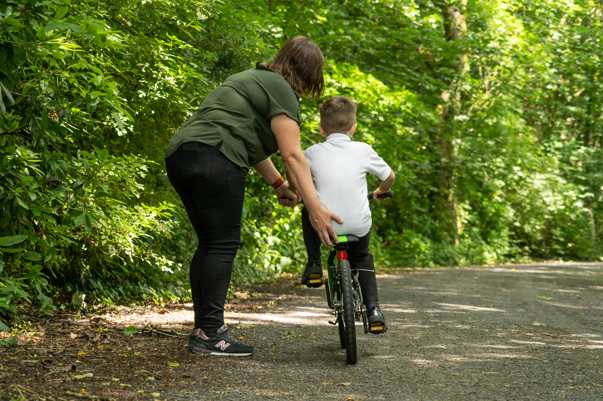
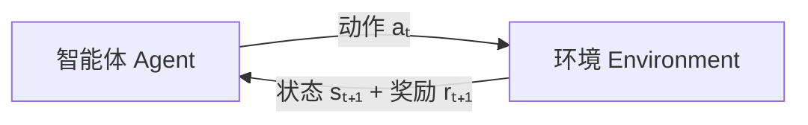
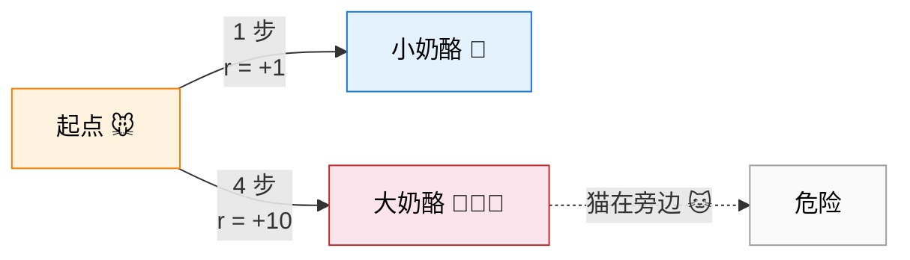
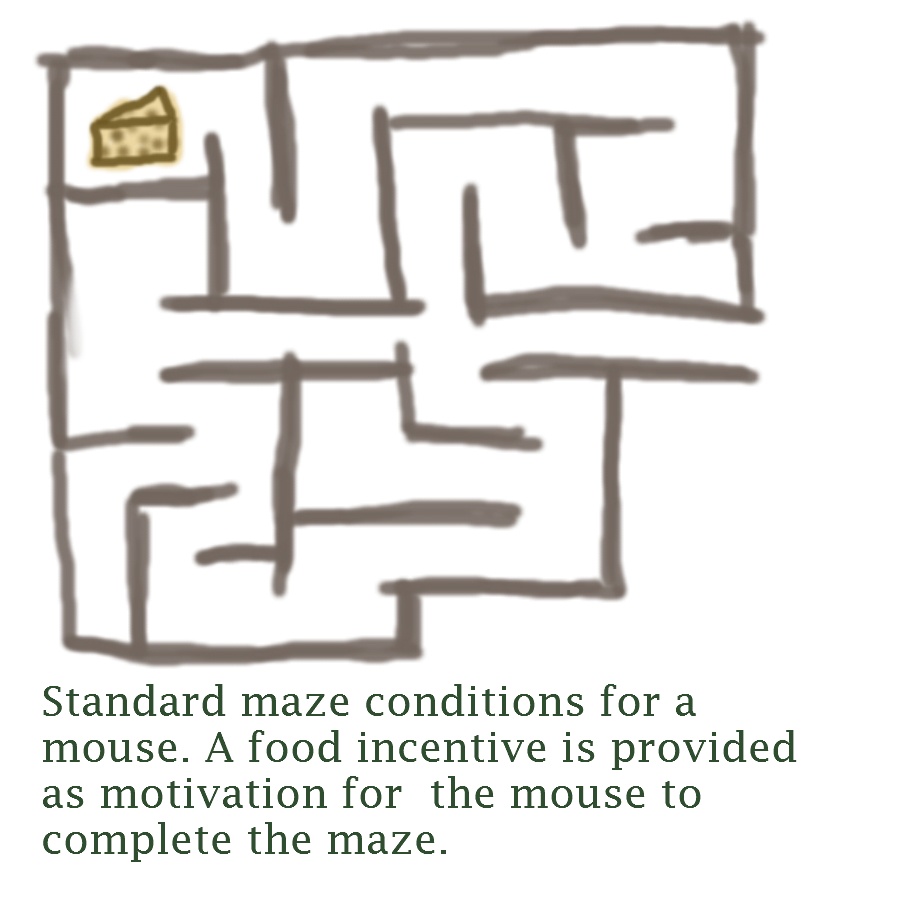
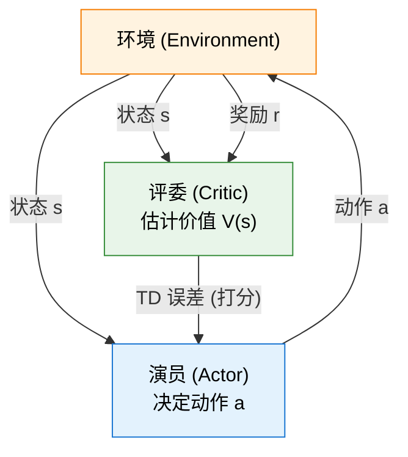
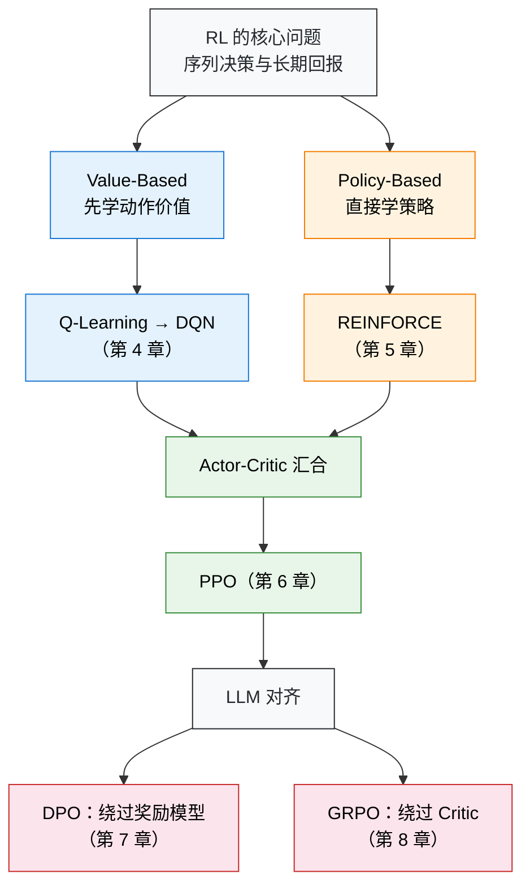

# 写在开头

## 为什么需要强化学习？

教一个小孩骑自行车，你会怎么做？

  <em>图 1：教小孩骑自行车的过程，正是一个典型的试错（Trial-and-Error）学习过程。来源：<a href="https://commons.wikimedia.org/wiki/File:Parent_helping_child_learning_to_ride_a_bike.jpg" target="_blank" rel="noopener noreferrer">Wikimedia Commons</a></em>

你不会先递给他一本《自行车物理学与平衡方程》，也不会在他上车前规定"当车身向左倾斜 5 度时右脚施力 10 牛顿"。你只是扶着后座，鼓励他自己去蹬。摔了，擦伤的膝盖就是负面反馈；稳了，迎面吹来的风就是奖励。几次下来，他的大脑在试错中自动学会了调整重心。

这种能力——**在未知环境中通过试错来学习，以最终的回报为导向**——是所有生物最本能的学习方式。可奇怪的是，过去十年的人工智能恰恰绕开了它。我们教会了机器认猫认狗、翻译语言、生成图片，用的全是同一种方法：给它成千上万个标注好的正确答案，让它照着学。但当问题从"识别"变成"决策"——让机械臂抓取水杯，让 AI 在星际争霸中打败职业选手，或者让大语言模型学会得体地回答问题——你根本无法为每一步标注出标准答案。

面对这些需要在动态变化中做连续决策的难题，**强化学习（Reinforcement Learning, RL）提供了一套截然不同的思路：不告诉 AI 怎么做，只告诉它什么好、什么不好，剩下的让它自己摸索。**从 Q-Learning 到 DQN，从 PPO 到 DPO 和 GRPO——强化学习的每一次进化，都在不断拓宽人工智能的能力边界。

本书将带你亲手用代码重走这段旅程。从最基础的倒立摆（CartPole），一路走到如何用 RL 激发大语言模型的推理能力。这不仅是一门技术，更是一种理解智能如何涌现的全新视角。

  <em>图 2：CartPole 倒立摆环境：小车通过左右移动来保持杆子竖直平衡。图源：<a href="https://gymnasium.farama.org/environments/classic_control/cart_pole/" target="_blank" rel="noopener noreferrer">Gymnasium</a></em>

## 什么是强化学习？

上一节我们用"教小孩骑自行车"的例子建立了对强化学习的直觉。现在，让我们把它变得更精确。

> 强化学习是一类解决**序列决策问题**的计算方法。一个**智能体（Agent）**处在某个**环境（Environment）**中，在每个时刻观察环境的**状态（State）**，据此选择一个**动作（Action）**；环境接收动作后转移到新状态，并给智能体一个标量**奖励（Reward）**作为唯一的反馈信号。智能体的目标：最大化整个交互过程中的**累积奖励**。

注意三个关键要素：**序列决策**（连续做多步选择，当前决策影响未来），**唯一的反馈是奖励**（不像监督学习有标准答案，智能体只知道"得了多少分"），**目标是累积回报**（不贪心单步奖励，着眼长期）。

### 核心循环

强化学习的交互过程是一个不断重复的循环：

1. 智能体观察到当前状态 $s_t$，选择动作 $a_t$
2. 环境执行动作，转移到新状态 $s_{t+1}$，返回奖励 $r_{t+1}$
3. 回到第 1 步

循环产出一条**轨迹**：$s_0, a_0, r_1, s_1, a_1, r_2, s_2, \ldots$

这里有几个重要的区分。**状态（State）**是对环境的完整描述（如国际象棋棋盘），**观测（Observation）**是部分描述（如超级马里奥只能看到角色附近画面）——本书通常用"状态"统称两者，代码中你会看到 `obs` 这个变量名。**动作空间**分两类：**离散**的（如马里奥只有左、右、跳、蹲 4 个动作）和**连续**的（如机械臂关节角度可取任意实数），不同类型需要不同算法。

关于奖励，智能体关心的是**累积回报 $G_t$**。但越远未来的奖励越不确定——就像迷宫中的老鼠，面前的小奶酪几乎一定能吃到，远处猫旁边的大奶酪却可能永远够不着。因此我们引入**折扣因子 $\gamma$**（0~1，通常 0.95~0.99）：

$$G_t = r_{t+1} + \gamma\, r_{t+2} + \gamma^2\, r_{t+3} + \cdots = \sum_{k=0}^{\infty} \gamma^k\, r_{t+k+1}$$

$\gamma$ 接近 1 表示重视长期回报，接近 0 表示只顾眼前。

> γ ≈ 0 时智能体倾向直奔小奶酪；γ ≈ 1 时愿意冒险绕路去拿大奶酪。

  <em>图 3：老鼠走迷宫寻找奶酪，是强化学习中常用的寻路与决策模型。来源：<a href="https://commons.wikimedia.org/wiki/File:MAZE_Mouse_Cheese.jpg" target="_blank" rel="noopener noreferrer">Wikimedia Commons</a></em>

整个 RL 大厦建立在一个哲学立场——**奖励假设**——之上：所有目标都可以描述为"最大化期望累积奖励"。只要能把"好"和"坏"量化成数字信号，RL 就有办法让智能体学会。

任务类型也有两种：**回合制（Episodic）**有明确的起点和终点（一局超级马里奥、一局 CartPole），**持续性（Continuing）**没有终点（自动化股票交易）。本书的实验都是回合制，方便用"每回合得分"衡量进展。

### 如何求解：两条路线

RL 还面临一个核心困境——**探索与利用（Exploration vs. Exploitation）**：利用已知最好的动作稳拿奖励，还是冒险尝试未知动作以发现更好的策略？就像选餐厅，每天都去同一家好吃的店（利用），可能永远错过街角那家更好的（探索）；但每天试新店（过度探索），又经常踩雷。探索太多浪费资源，太少则陷入次优、永远进步不了。

所有 RL 算法都在回答同一个问题：如何选择动作以最大化累积回报？回答这个问题有两条截然不同的路线，在此之前先认识一个核心概念——**策略（Policy）$\pi$**，它是智能体的"大脑"，即给定状态输出动作的函数。训练的终极目标就是找到**最优策略 $\pi^*$**。策略分两种：**确定性**策略对同一状态永远输出同一动作（$a = \pi(s)$），**随机性**策略输出动作的概率分布（$\pi(a|s) = P(a|s)$）——后者天然兼顾探索，因为总有小概率去尝试非首选动作。

那么，怎么找到最优策略？有两条截然不同的路线：

**路线一：基于价值（Value-Based）**——先搞清楚每个动作"值多少分"，再选最高分。想象你在走迷宫，每到一个岔路口，你都能看到一块牌子：往左走预计总共能拿 80 分，往右走预计总共能拿 30 分——于是你选往左。这块"牌子"就是**价值函数**：它不直接告诉你该走哪条路，只告诉你每条路的预期回报，选哪个你自己决定（当然是选最高的）。代表算法：Q-Learning → DQN。

**路线二：基于策略（Policy-Based）**——跳过打分，直接学"看到什么就做什么"。还是走迷宫的例子，你不给路打分了，而是反复走很多次迷宫：走到终点就加强沿途每个选择的信心，掉进陷阱就削弱。走得多了，好动作的概率自然上升，坏动作的概率自然下降。代表算法：REINFORCE → PPO。

两条路线各有短板：路线一擅长打分但不擅长探索，路线二擅长探索但打分不够准。**Actor-Critic** 把两者拼在一起——用路线一的方法训练一个"评委"（Critic）来评估每个动作的好坏，再用路线二的方法训练一个"演员"（Actor）来选动作。评委的评分越准，演员的进步就越快；演员尝试的新动作越多，评委的评分也越准。

  <em>图 4：Actor-Critic 架构示意图：演员（Actor）负责执行动作，评委（Critic）负责根据环境奖励为动作打分并指导演员改进。</em>

最后一个问题：这些"打分表"和"行为手册"具体长什么样？简单环境下可以是一张小表格，查表就行。但像 Atari 游戏那样，一帧画面就有几十万个像素，表格根本装不下。**深度强化学习（Deep RL）**的做法是用神经网络来代替表格——如果神经网络学的是"打分表"，它就是 Value-Based（如 DQN）；如果学的是"行为手册"，它就是 Policy-Based（如 REINFORCE）；如果同时学两者，它就是 Actor-Critic（如 PPO）。本书所有算法都属于 Deep RL。

---

以上是强化学习的概念框架。初次接触难免觉得术语密集，不必在此停留太久——后续各章会通过代码和实验逐一展开，每遇到一个概念，你都会有具体的动手经验与之对应。

## 关于本书

2016 年，AlphaGo 击败李世石，强化学习第一次震撼公众。2022 年 ChatGPT 发布，人们发现 RL 正是让大语言模型从"能说话"变成"说好话"的关键技术。从 DeepSeek-R1 到各类开源对齐模型，RLHF、DPO、GRPO 等算法已经深刻地重塑了整个 AI 行业。

  <em>图 5：ChatGPT 等大语言模型的崛起，标志着强化学习在人类偏好对齐和复杂推理上的成功。来源：<a href="https://commons.wikimedia.org/wiki/File:ChatGPT.png" target="_blank" rel="noopener noreferrer">Wikimedia Commons</a></em>

然而，市面上的学习资源严重滞后于行业实践。主流教程对 RL 一笔带过，专门的 RL 教材又停留在传统框架，对 PPO、DPO、GRPO 只字不提。一个想要理解 RLHF 流程的工程师，不得不在经典教材和最新论文之间艰难地自行搭建桥梁。我们着手写这本书，就是为了填补这道鸿沟。

这本书代表了我们的尝试——**让现代强化学习变得平易近人，用代码、数学和直觉的融合来教会人们核心概念。**

### 一种"先动手、后理论"的学习路径

许多教科书先讲完 MDP 的全部性质，再讲贝尔曼方程，最后才允许你碰一行代码。在这本书中，**你将从第一章的第一行代码开始训练一个智能体**。当你亲眼看到 CartPole 的小车从摇摇晃晃到稳稳站立，亲手用 DPO 让一个大模型学会"说好话"，再回过头理解背后的数学时，学习过程会更加自然，理解也会更加持久。

每一章都遵循一个四步循环：先给你一段可运行的代码，让你获得直接经验；然后引导你关注训练曲线上的关键现象；接着在具备直觉的基础上讲解数学原理；最后用理论重新解读之前的现象，完成从直觉到形式化的闭环。

### 代码与理论并重

本书的每一章都包含可运行的代码示例。**强化学习中的许多直觉只能通过试错来建立**——调一调学习率，观察 reward 曲线的振荡；改一改 clip 参数，看看策略是否会崩溃。这些经验无法仅靠阅读公式来获得。

### 内容和结构

全书大致可分为四个部分，在下图的核心脉络中用不同的颜色呈现：

上图是全书算法的主线。左侧蓝色分支是 **Value-Based**——先估计每个动作能得多少分，再选得分最高的；右侧橙色分支是 **Policy-Based**——跳过打分，直接学习在什么状态下该做什么动作。两条路线在 Actor-Critic 处合流，由此长出 PPO，而 PPO 正是后续所有 LLM 对齐算法的骨架。

**第一部分包括快速入门。**

- **第 1 章**带你零基础运行第一个 RL 训练脚本，在 CartPole 倒立摆上获得"AI 能自己学会一件事"的第一手感受。
- **第 2 章**将场景从"游戏控制"切换到"语言对齐"，用一个完整的 DPO 微调流程让大语言模型从"毒舌"变成"礼貌"，体验现代 RL 如何直接作用于大模型。

**接下来的四章集中构建强化学习的理论与方法体系。**

- **第 3 章**引入 RL 的数学基石——马尔可夫决策过程（MDP），从多臂老虎机问题出发，逐步建立状态、动作、奖励的形式化框架，并推导出贝尔曼方程。
- **第 4 章**进入深度强化学习，展示 DQN 如何将 Q-Learning 从一张小表格搬进神经网络，通过经验回放和目标网络让智能体直接从 Atari 游戏像素中学会决策——这也是深度学习与强化学习融合的里程碑。
- **第 5 章**转向另一条路线——策略梯度方法，从 REINFORCE 到带基线的策略梯度，再搭建 Actor-Critic 架构，让 Value-Based 和 Policy-Based 两条路线在此汇合。
- **第 6 章**聚焦 PPO，深入裁剪（Clipping）和广义优势估计（GAE）两大核心机制，在月球着陆器上实践稳定训练的艺术——PPO 既是游戏控制时代的集大成者，也是后续所有 LLM 对齐算法的出发点。

**第三部分讨论大语言模型时代的对齐算法。**

- **第 7 章**从数学上揭示 DPO 如何将奖励信号"隐藏"在策略概率比中，绕过整个奖励模型训练环节，并扩展到 KTO、SimPO 等 DPO 变体，构成一个完整的离线偏好优化方法族。
- **第 8 章**介绍 GRPO 如何用组内相对优势进一步省去 Critic 网络，以及 RLVR（Reinforcement Learning with Verifiable Rewards）如何用数学题的标准答案和代码测试用例替代人工标注的奖励模型，追踪 DeepSeek-R1-Zero 和 DAPO 的最新进展，展望 RL Scaling 的未来。

**第四部分将 RL 基础与工业界前沿场景对接。**

- **第 9 章**从离散动作扩展到连续力矩控制，介绍 DDPG、TD3 和 SAC 等连续动作空间算法，这是 RL 走向机器人控制等物理世界的必经之路。
- **第 10 章**串联 SFT → RM → RL 三阶段，构建一条完整的 RLHF 工程流水线，覆盖数据工程、奖励函数设计和训练稳定性控制等实际工作中的核心挑战。
- **第 11 章**把 RL 从纯文本推进到视觉-语言模型（VLM），分析多模态 RL 中视觉幻觉、奖励归因等独特问题。
- **第 12 章**聚焦 Agentic RL——如何用 RL 训练能在环境中连续行动、调用工具、多轮交互的智能体，这是从"对话模型"到"自主智能体"的关键跨越。
- **第 13 章**展望 Test-time Reasoning、具身智能、多智能体协作、离线 RL 和自博弈等前沿方向。

### 目标读者

本书面向学生、工程师和研究人员。不需要过往的深度学习或机器学习背景，只需基本的 Python 编程能力、线性代数（矩阵运算）、微积分（偏导数、链式法则）和概率论基础（期望、条件概率）。大多数时候，我们会优先考虑直觉和想法，而不是数学的严谨性。

## 环境与硬件要求

本课程的实验代码兼容主流操作系统：

- **Linux**（推荐）：Ubuntu 20.04 及以上版本，对深度学习生态支持最为完善。
- **Windows**：通过 WSL2（Windows Subsystem for Linux 2）即可运行全部实验，安装简便。
- **macOS**：Apple Silicon（M1/M2/M3/M4）和 Intel Mac 均可运行大部分实验。

GPU 与显存需求按三个层级划分：

| 层级     | 显存需求             | 覆盖范围                                            | 典型硬件                     |
| -------- | -------------------- | --------------------------------------------------- | ---------------------------- |
| 入门实验 | CPU 即可 / 4GB+ 显存 | CartPole、Atari、策略梯度等经典 RL 实验             | 集成显卡、GTX 1650 等        |
| 核心实验 | 24GB 显存            | DPO 对齐、PPO 训练、GRPO 等大模型相关实验           | RTX 3090、RTX 4090、A5000 等 |
| 大型项目 | 80GB 显存            | 少量大规模模型训练（如 7B+ 模型的完整 RLHF 流水线） | A100、H100 等                |

大部分实验控制在 **24GB 显存**内即可完成，一张消费级显卡（如 RTX 3090 / 4090）足以覆盖全书超过 90% 的动手内容。只有少量涉及大模型全参数训练的进阶项目才需要 80GB 级别的显卡。

::: tip
体验本课程的成本并不高。一台普通笔记本就能跑通入门实验，一张 24GB 显存的消费级显卡足以覆盖绝大多数核心内容。
:::

## 小结

- 强化学习已经从实验室走向工业界，成为大语言模型后训练、机器人控制、游戏 AI 等领域的核心技术。
- 本书采用"先动手、后理论"的教学路径，每章都包含可运行的代码和系统化的数学讲解。
- 全书覆盖从 MDP、Q-Learning 到 PPO、DPO、GRPO，再到 LLM 对齐和智能体 RL 的完整知识图谱。
- 只需基本的 Python 编程和数学基础即可开始学习。
